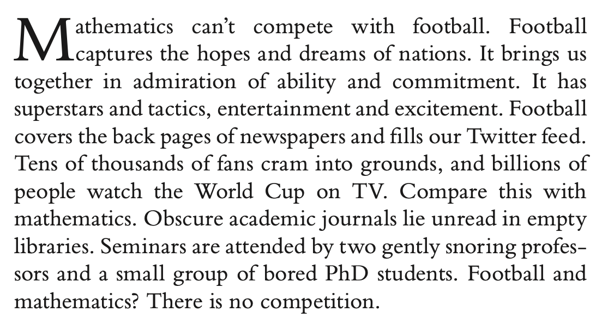
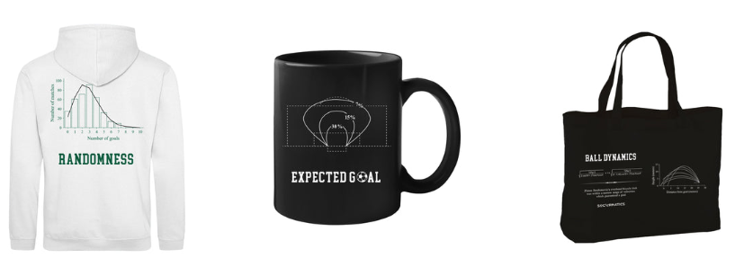

Welcome to Soccermatics
=======================

This course is the most comprehensive education available
on how to work with football data. We will learn how to understand the
game using mathematics, statistics and machine learning.

It is taught by Soccermatics author David Sumpter, with guest lectures from world-leading
practitioners and researchers working with data in football. It
offers the technical skills you need to get a job as a data scientist at a
football club or in the football industry.
Students graduating this course have found jobs in
all parts of the football industry. And clubs and
national teams send their data scientists to this course
in order to improve their skills.

The course utilises data from Wyscout, Statsbomb,
Metrica, Signality, Skillcorner and other leading data providers.
It also reflects the state of the art in research on
football analytics. Much of the work presented is
based on recent work presented at, for example,
Sloan Sports Analytics and The Opta Forum.

It is also a fun and interesting way to learn mathematical modelling techniques used in
many areas. Indeed, this course isn't the same as a normal maths, statistics or
machine learning course, where you might learn specific techniques. The type of techniques we
will use vary alot. We will start with techniques from data
visualisation, then move on to logistic regression, learn about various
probability distributions, a bit of geometry and physics, self-propelled particles
and use some machine learning and AI methods.

The reason for this structure is that the real
world  is not like a maths class. When we model reality
– be it a football match, the spread of disease or the movement
of a bird flock – we don't start the process on page one of a
textbook. Mathematical modelling, which this course is about,
is more creative than that. For each problem we face,
we need to use a different piece of mathematics
to get to the heart of the problem.

Sometimes very advanced topics in maths and statistics,
turn out to be much easier to grasp in the context of
applications. Probability theory can be quite an abstract
area of maths, but by looking, as we do in section 4,
at a concrete example of goals in football or soldiers
getting kicked by horses, we can quickly get a feeling
for the theory. **Abstract ideas become more concrete
with applications.**

Formal Course
=============

**Students:** This is 5 credit course at `Uppsala University
<https://www.uu.se/en/admissions/freestanding-courses/course/?kKod=1RT001&typ=1>`_
and is taught as an online course in late-August to end of October each year.
It is free for all EU citizens and available as a
paid course for everyone else. The university includes
tutorials with me and a teaching assistant,
individual hand-ins and group work.

**Professionals:** If you are a part of a footballing
organisation, then it is possible to take this course as part of
further education. The professional course has less
formal requirements for entry, allowing
your organisitaion to benefit from it. Each time the course is run
a separate "professionals"
tutorial session is run, with tutorials with David.
We encourage participants
to work with their own data. In 2022, we have a group of
participants from the English FA
on the course. Please email David (david.sumpter@it.uu.se)
for information about fees.

**Non-enrolled students:** Several students
(some of whom are now working for football clubs)
have completed this course through online study groups.
To do this, you need to find a group, since all final projects
are in groups. If you would like to do this, please go in to the
[Slack channel]
(https://mathematicalm-fhj6138.slack.com/archives/C0183122E81)
and find some like-minded people to work with.

If you complete all three assignments for the course message
David Sumpter in the Slack channel, send him your assignments,
and if they are complete then he can send you a certificate
saying you have completed the course.

Unfortunately, I am not able to provide feedback for non-enrolled
students along the way. But often by working together in the Slack group,
students find a way of learning together.

Required Background
===================

When I teach this course at Uppsala University, we set
prerequisits of university
level courses in statistics, linear algebra and calculus. It is
taught as a late undergraduate/Masters level course.
There will be starter/refresher Intro to Python programming
and statistics, but the learning curve will be
relatively steep for those without this background.
In short, to do this course
you should have studied mathematics and programming at
University level.
You should also, of course, have an interest in football.

It is possible to grasp the concepts without
the technical background, especially if you love football! So,
feel free to give it a try. The worst that can happen is that
you will learn to plot shot locations on a football pitch.

History
=======

This course developed from the `Friends of Tracking Youtube channel
<https://www.youtube.com/channel/UCUBFJYcag8j2rm_9HkrrA7w>`_.
It was recorded during the Covid-19
lockdown in April/May 2020 by a group of club analysts
and leading academics. These include lead data
scientists:
Javier Fernandez (Barcelona), Sudarshan Gopaladesikan (formerly Benfica, now Atalanta)
William Spearman (Liverpool), Laurie Shaw (Manchester City), Fran Peralta
(formerly Hammarby, now Atletic Bilbao), Alex Thomas (The English FA), Pascal Bauer (German DFB)
and many more. We initially made this work available at the `Friends of Tracking Youtube channel
<https://www.youtube.com/channel/UCUBFJYcag8j2rm_9HkrrA7w>`_.

This course uses some of those videos and adds further videos and
course notes. It was made possible, through the kind help of Andy Rowlinson,
who both allowed us to use `MPL Soccer
<https://mplsoccer.readthedocs.io/en/latest/index.html>`_ (a library for plotting event data) and
helped set-up this website. The code for this course was written by David Sumpter,
together with Aleksander Andrzejewski (a former student of the course). We use several
examples in this course from work with `twelve.football
<https://twelve.football>`_ .

Soccermatics
============

This course also builds on and uses a number of examples from
my book
`Soccermatics <https://www.amazon.co.uk/Soccermatics-Mathematical-Adventures-Pro-Bloomsbury/dp/1472924142/ref=sr_1_1?crid=2XKJD22W8KJFD&keywords=Soccermatics&qid=1660842044&sprefix=soccermatics%2Caps%2C98&sr=8-1>`_
.
We will often return to the book for
inspiration, like the opening the paragraph of the book below,

But we will also go further than the book. Indeed, the reason
I have created these pages is **to teach the maths behind
Soccermatics**. To give you the analytical skills you need
to understand the beautiful game and to create mathematical models.
This course is (I think) more fun if you work on it while you
read the book. So don't delay, get it today.

Since writing Soccermatics, I have worked with
data scientists at the
English FA, Barcelona, Manchester City, Benfica, Ajax and Hammarby.
I have worked with sporting directors, scouts, managers, TV presenters,
and even players with data analysis. I will bring many of
those experiences to the course.

Buy the T-shirt!
================

If you are studying the course and reading the book, you might as well buy the t-shirt!
Or get a mug, a water bottle or another Soccermatics themed item.

These are exclusively available from `Beautiful Equations <https://www.beautifulequation.com/pages/soccermatics>`_

Contents
========

.. toctree::
   :maxdepth: 1
   :caption: Getting started:

   gettingstarted.md
   gallery/plot_UsingStatsbomb
   gallery/plot_UsingWyscout

.. toctree::
   :maxdepth: 1
   :caption: 1, Event Data:

   lesson1/VisualisingFootball.md
   gallery/lesson1/plot_PlottingShots
   gallery/lesson1/plot_PlottingPasses
   gallery/lesson1/plot_PassNetworks
   lesson1/passnetworksExample.md
   gallery/lesson1/plot_PassHeatMap
   lesson1/heatmapsExample.md
   lesson1/BallRecoveries.md
   lesson1/GoodVisualisation.md

.. toctree::
   :maxdepth: 1
   :caption: 2, Models:

   lesson2/statisticalModelsIntro.md
   gallery/lesson2/plot_LinearRegression
   lesson2/Possession.md
   lesson2/introducingExpectedGoals.md
   gallery/lesson2/plot_xGModelFit
   lesson2/GeometryOfShooting.md
   lesson2/MoreonxG.md
   gallery/lesson2/plot_PassCompare

.. toctree::
   :maxdepth: 1
   :caption: 3, Scouting:

   lesson3/ScoutingPlayers.md
   gallery/lesson3/plot_RadarPlot
   lesson3/SpreadsheetScout.md
   lesson3/PlusMinus.md

.. toctree::
   :maxdepth: 1
   :caption: 4, Valuing actions:

   lesson4/EvaluatingActions.md
   gallery/lesson4/plot_MarkovChain
   lesson4/xTPos.md
   gallery/lesson4/plot_ExpectedThreat
   lesson4/xTAction.md
   gallery/lesson4/plot_PossessionChain
   gallery/lesson4/plot_xGchain

.. toctree::
   :maxdepth: 1
   :caption: 5, Randomness and prediction:

   gallery/lesson5/plot_simulatematch
   lesson5/DealingRandomness.md
   gallery/lesson5/plot_SimulateMatches
   lesson5/TeamKPIs.md
   gallery/lesson5/plot_PointsMovingAverage
   lesson5/CaseHammarby.md
   lesson5/Philosophy.md

.. toctree::
   :maxdepth: 1
   :caption: 6, Pitch control :

   lesson6/PitchControl.md
   lesson6/TheCross.md
   lesson6/PassProbability.md

.. toctree::
   :maxdepth: 1
   :caption: 7, Positioning and Movement:

   lesson7/ValuingOffBall.md
   lesson7/OffBallRuns.md
   lesson7/OffBallRadars.md
   lesson7/ImprovingPassingModels.md

