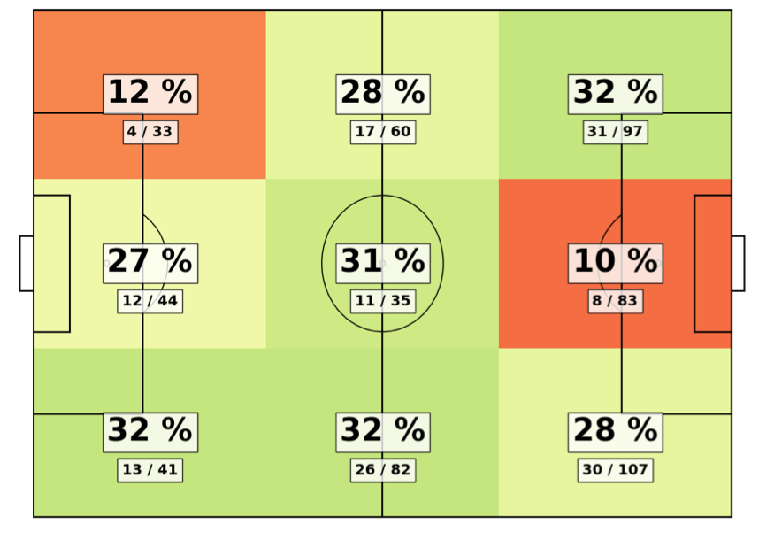
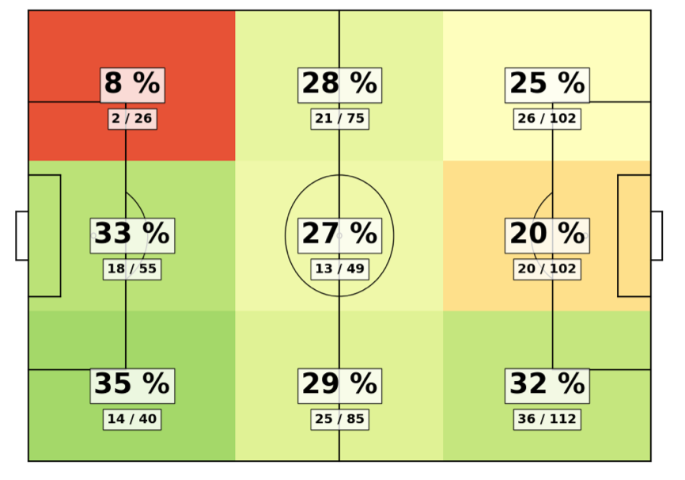

Case study: 5-second rule 
==========================

Here we describe the implementation of a Kay Performance Indice (KPI) at Hammarby. 

## Key performance indices (KPIs)

Whenever we see a TV program or film about statistics in sport there is nearly always a scene where we are shown a wall of numbers scrolling down the screen, sometimes on a computer monitor, other times as a special effects flow of numbers through the ether around our sporting heroes. We are told how many measurements we can make per second of the players’ heart rate, the velocity of their movement and their gaze direction. Everything is logged and monitored.

But these numbers are not in themselves important. It is how we use them which is the key. It is how we distil them down to a single number. We usually refer to these single numbers as Key Performance Indices (KPIs) or metrics. I will use KPI’s in what follows.

## Gatting the ball back

Let’s make this idea of a KPI concrete using an example: the five second rule, usually attributed to Pep Guardiola Barcelona’s team of 2008-12, but now a wide-spread idea in the game: “if you lose the ball when attacking then regain it within five seconds, if not fall back in to a more traditional defence”.  

This idea then leads to a very natural KPI: how often do we get the ball back within 5 seconds after we lose it. In making this measure, it is important to also take in to account of position on the field. The ‘five-second-rule’ is mainly used in attack, so regains in the final third are more important (and often more dangerous) than in the team’s own half. 

When we implemented this KPI at Hammarby, we divided the pitch in to nine sections. Here are the stats for the first 10 matches of the 2020 season:

The percent is the proportion of times that Hammarby recovered the ball after they lost it in each section of the pitch. The shading reflects this percentage: orange is bad, green is good. The numbers below show the same number as a fraction, so we can also see how often we lost the ball in different zones. 

The numbers at this point in the season were disappointing for Hammarby, significantly reduced from the season before, where pressing and recovering the ball had been a big part of the game plan. In particular, in the dangerous area in front of the opponent’s goal, Hammarby lost the ball 83 times and recovered it within 5 seconds only eight times. 

## Using the numbers

Presented in this way, this statistic then becomes something that the team can work together to improve. Instead of saying ‘we haven’t scored enough goals’ or ‘we haven’t created enough chances’ we can look at a specific feature of our play and think together about how to improve that aspect.

Hammarby did improve in counter-pressing and ball recovery by the end of the season. Here are the numbers for the last 10 games of the season.

Hammarby’s ball recoveries in front of the opponent’s goals had doubled. The team had worked together to improve their performance. 

The ‘5-second’ KPI has an important property: it is grounded in a footballing principle. Fundamentally, football is the sport of the people, not of an elite. It is a grassroots activity. It is knowledge steeped in practices, communicated through players watching other players and learning, through verbal instructions on the pitch, and through practicing the techniques over and over again, both on your own and with your friends. Working together to get the ball back quickly is one such footballing principle.

## Numbers aren't everything

KPIs on the other hand are typically the tools of economics professors, company executives and graduates from MBA programmes. The culture here is one of measurement and targets. It is of a desire to control and predict. 

The key to creating a good KPI is finding something that combines the practices of grassroots football and the culture of measurement and prediction. Remember, the mantra for this series of articles is that ‘football is a complex system, so there are many valid ways to look at it’. And this mantra applies here: we have two different ways of seeing the game, how do we bring them together? 

The ‘five-second’ KPI is one answer to this question. Other valuable KPIs – some of which we look at in coming articles – include entries in to the final third, passing tempo, decentralised passing, off-the-ball space creation and variation in style of attack. In general,  when creating a KPI you should ask yourself the following question: why are you collecting a KPI about a football team?

If the answer is that you wish to simply assert your authority, then you should be worried that you are not creating a KPI for the right reasons. For example, setting up a target for goals or chance creation (expected goals) is dangerous, since it focuses only on the outcome, not on the process. But if the answer is that you are trying to partly capture and understand the unwritten, and maybe even unspoken, aims of the whole team, then you are on the right track. A measurement should be something which helps everyone move toward, an attempt to capture something that the whole organisation agrees it is worth measuring. 

