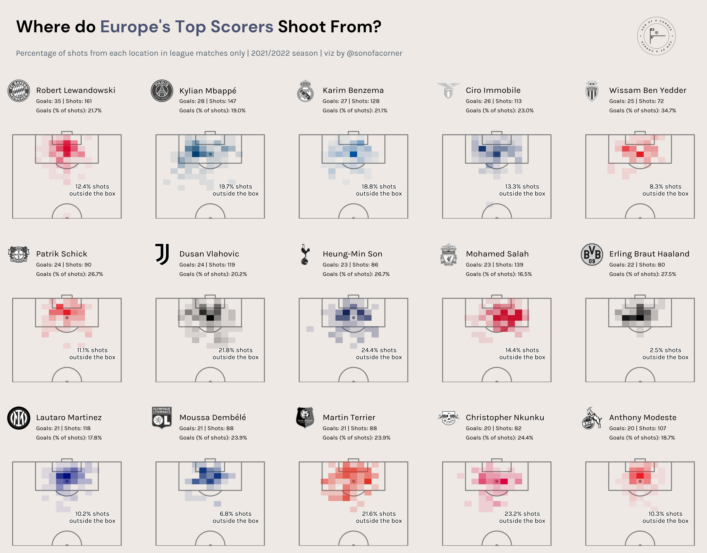

Improving your visuals
======================

We have focussed on getting the basics right in this section. There is however a lot more to learn about visualisation
and, in particular, how to communicate with graphics. 

### Peter McKeever

A great starting point is StatsPerform's
Peter McKeever who gives great insight in to how to make better data visualisations. 

<iframe width="640" height="480" src="https://www.youtube.com/embed/md0pdsWtq_o" 
title="YouTube video player" frameborder="0" allow="accelerometer; autoplay; clipboard-write; encrypted-media; gyroscope; picture-in-picture" allowfullscreen></iframe>

Peter has an [excellent website](http://petermckeever.com) with code and further 
examples. He also mentioned in the talk the blog by [Lisa Charlotte Muth](https://lisacharlottemuth.com).

### Maram AlBaharna

Maram creates unique visuals using from football data.  In this Friends of Tracking episode, we talked to her about how she works.

<iframe width="640" height="480" src="https://www.youtube.com/embed/D0iY1C31Xfg" title="YouTube video player" frameborder="0" allow="accelerometer; autoplay; clipboard-write; encrypted-media; gyroscope; picture-in-picture" allowfullscreen></iframe>

The work she did online landed her a job at [The Athletic](https://theathletic.com/author/maram-albaharna/). 

### Son of a corner

Another 'up and coming' football visualiser is Son of a Corner. Here are heat shot maps for top strikers 
around Europe 

If you want to follow his method, he gives a [step-by-step guide](https://www.sonofacorner.com/shot-maps-a-matplotlib-tutorial/) here.

