Visualising football
====================

In this section we look at a variety of ways of analysing event data in football. 
Event data is everything that happens on the ball. It is sometimes supplemented with information,
such as whether a pass is made under pressure, but the focus is very firmly on individual ball 
events: tackles, passes, shots, interceptions etc. 

What we will learn  is how to create useful visualistions of this data. 
Start by watching the video!

VIDEO HERE

It is the job of the mathematician to take a lot of complex data and boil it down to 
a simple but powerful idea. In football, the message needs to be even more direct. 
In the dressing room at half-time, with the team behind by two goals and unable to 
keep control of the ball, the manager has to be able to convey a plan quickly. 
Imagine what you would do in that situation? The manager is lost for ideas, 
and in a final act of desperation he turns to you, the mathematician, and asks,
‘Can you see the problem?’

We will maybe not be able to give half-time advice (not yet anyway) but we 
will learn ways to visualise the data in the way that helps coaching staff understand the game better.

### Shot and pass maps

The Real Madrid side of 2014/15 were built around a talented midfield releasing balls to 
three explosive forwards: Cristiano Ronaldo, Karim Benzema and Gareth Bale. The figure below 
is a map of their shots during their 12 Champions League games that season.

Ronaldo gets a lot of shots in during a game, and he makes them 
from everywhere in and around the box. 
Benzema has fewer shots but enjoys a much higher conversion rate than Ronaldo,
scoring with almost half the shots he makes from inside the box (circled dots are goals in this data).
In comparison,  Ronaldo might look a bit wasteful: he took 35 shots from outside the box 
and didn’t score a single time! Bale, who was criticised by some Real fans and the 
Spanish media during the campaign for being greedy in front of goal, was 
reasonably cautious. Bale has a few clusters of points he likes to shoot from: 
outside the box on the right, left of the penalty spot and from near the right-hand post. 
Unfortunately for him, he only managed to score from the last of these positions.

Even in simple black and white, these maps characterise the difference between players.

Pass maps have a start an end point, where the pass came from and where it ends up. I found 
these pass maps particularly interesting during Liverpool's 2019-20 season. They show the most dangerous 
passes produced by their left and right backs. 

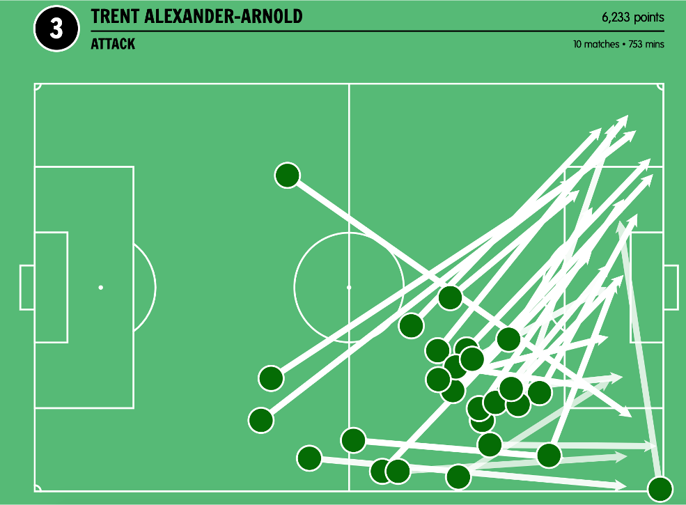
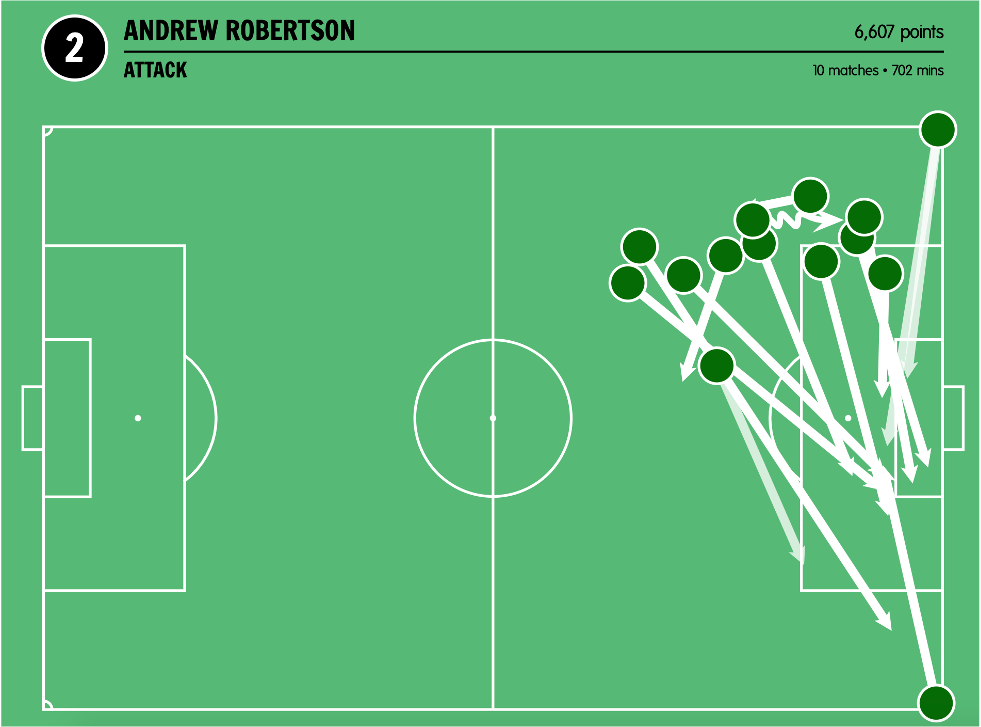

This captured very well how these Alexander-Arnold and Robertson contributed to attacking play.

Now go in to [plotting shots](../gallery/lesson1/plot_PlottingShots) and learn how to make 
plots like this yourself.

### Passing networks

A passing network can really tell the story of a game. One of the first 
I ever created was this one from Italy vs England in Euros 2012.

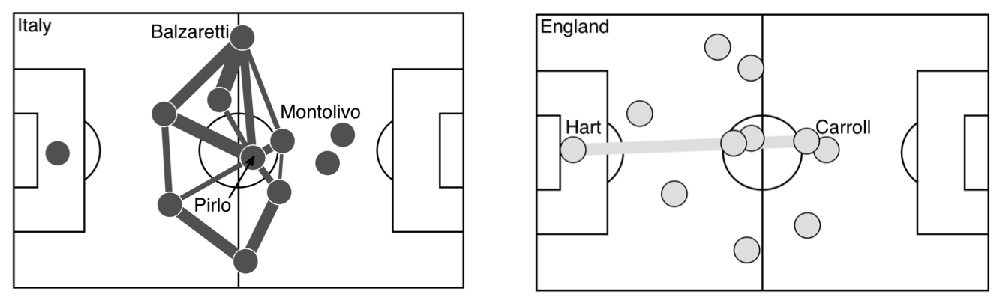

Each point represents a player. A link between pairs of players 
indicates that they made 13 or more successful passes to 
each other during the match. Thicker lines indicate a higher number of passes.
It’s immediately clear that Italy made a lot more successful passes than England. 
The focus was Andrea Pirlo.He dispatched the 
ball successfully 115 times, orchestrating most of the Italian attacks. England tried 
to get the ball to Wayne Rooney, playing longer balls towards him down the middle, or by crossing to him from the wings. As the match progressed, England’s approach became even more direct. On 60 minutes, Andy Carroll came on. At 1.93m (6’4) he was the tallest out- field player, and controlled the airspace in the centre. Once he had recovered the ball after each of the many Italian attacks, Joe Hart kicked it directly up to Carroll (see bottom panel in Figure 7.1).
It’s quite impressive that Carroll managed to win the ball so many times from Hart’s kicks. 
Despite being on the pitch only half as long as most of the other players, 
he was one end of England’s most successful passing partnership. 
But Hart and Carroll’s success reveals failures elsewhere. 
England had no consistent passing network in midfield. 
Instead, the Italians dominated the match, with 68% of possession and 36 shots. 
Italy passed the ball forward and England tried to kick it over their heads. 

A more recent example, of a similar sort of pattern of playing to one attacking player can
be seen in Denmark's 2022 Euros quarter finals game against Spain. 

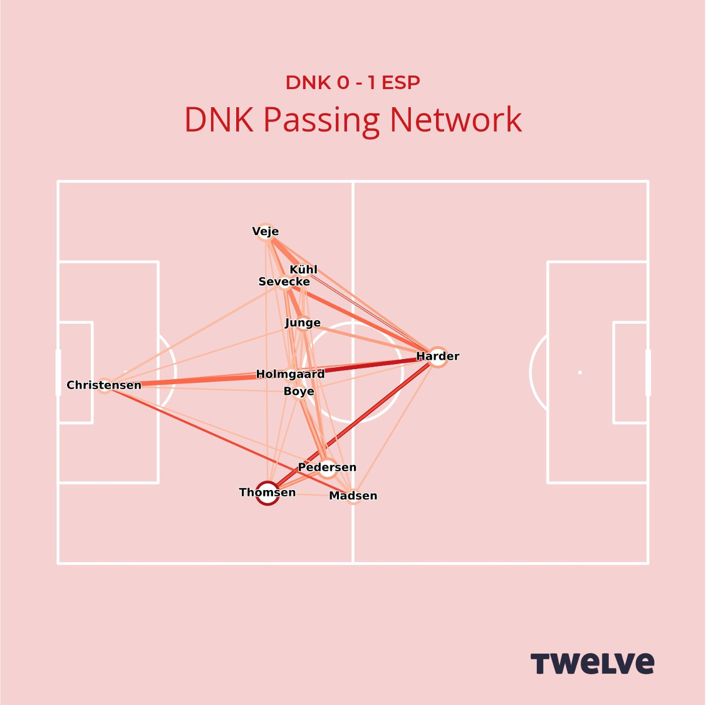

Although Denmark lost this game, they had a clear strategy against the high-possession
team Spain: get the ball to Pernille Harder. In the end the goal never came, but they came 
close. 

Now go in to [passing networks](../gallery/lesson1/plot_PassNetworks) and 
make these networks yourself. 

### Heat maps

Let's look again at th 2014/15 Real Mardid side. In the period leading up to a shot, 
the ball typically 
moves around a lot as the attacking team tries to find a way through the defence. 
By marking every point at which the ball was played just before each of the Real 
Madrid shots during the Champions League season, we can get an overall picture of 
how they create successful attacks. Figure 7.12 is a risk map showing where the ball 
was played in the 15 seconds 
leading up to a shot from the 20m by 20m area in front of goal.

The darker areas show places where there is a high risk of a Real Madrid shot 
from the danger zone coming within the next 15 seconds; the lighter areas 
show places where the risk is low. Corners are one clear risk-zone and, not 
surprisingly, if the ball is already in the box then the risk of a shot is high. 
But the most interesting risk zone is the hot area outside the box on Real Madrid’s left. This area of the pitch is mainly occupied by Marcelo, who comes up on the left wing, and Ronaldo, who is more central. 
It is from here that dangerous chances are created.

The 15-second window brings context to the touches made by Ronaldo. In the video lecture above 
I look at another touch map, which does not give context. These tend to be less informative, 
simply because not all touches are as dangerous in football.

So far we have concentrated on passes, but a similar approach can be taken to all actions.
The plot below shows a measurement of defensive actions per pass by the opposition
in the Championship.  This was the season before Leeds won promotion, but we see clearly here how 
much defending they are doing for every pass the opposition makes.

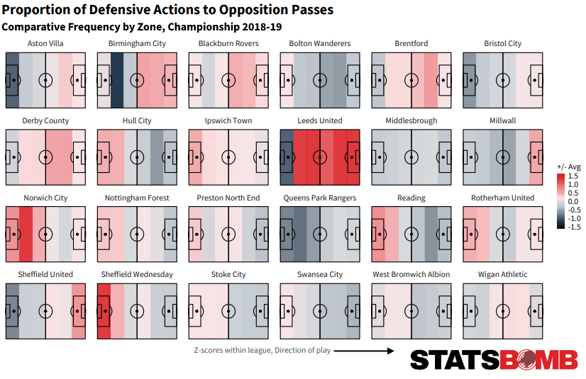

Several important adjustments are made in this heatmap. Firstly, it is defensive actions per pass, instead of total
defensive actions. This adjustment is made because if a team is only defending then it will, by defintion, 
only be performing defensive actions. Only defending is generally not good. The adjustment thus corrects for how much time the 
opposition have the ball. The second adjustment, is the use of a Z-score in the colour 
bar instead of a count of  actions. This means that we measure the team 
performance relative to the league: Leeds carry out alot of defensive actions. 

The [Statsbomb article](https://statsbomb.com/articles/soccer/leeds-united-under-marcelo-bielsa-an-analytical-review/)
, from which this image is taken, 
gives an excellent statistical account of Leed's season and their pressing, in particular.

### Key Performance Indices (KPI)

It is important for clubs to develop a culture around Key Performance Indices (KPIs). 
These should be set by the coaching staff, working together with data scientists and the 
clubs management, to find aspects of the team's style of play 
that is measureable and can be communicated in a clear visualisation. 

Below are a few examples of visualisations of KPIs for Liverpool's last ten games in the Premier League season 2021-22
using the [twelve.football](https://twelve.football) platform. These are measured over 10 matches (the last 10 of the season). 
Usually measurements between six and ten matches gives a reliable idea of form. We develop KPIs with clubs 
to match their style of play. 

#### Expected Goals

The first visualisation is a shot map where and report on expected goals.

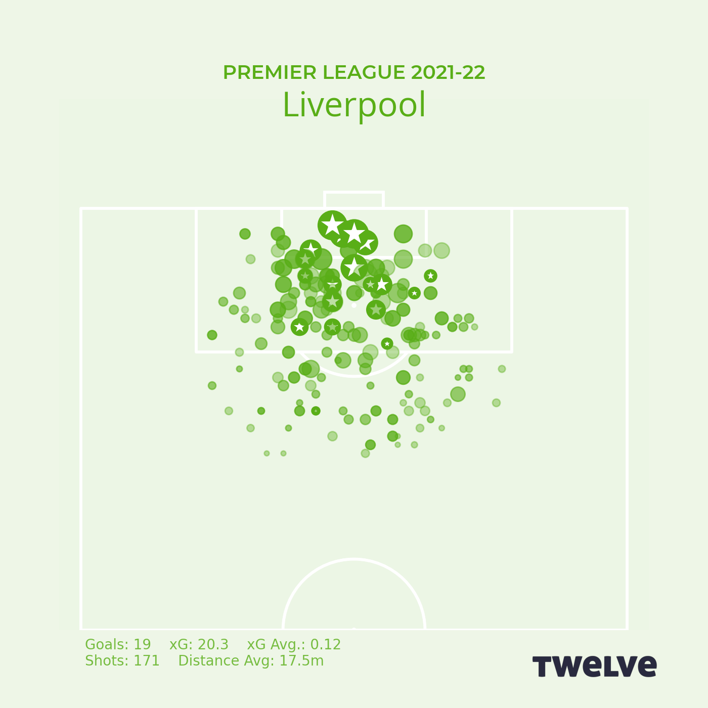
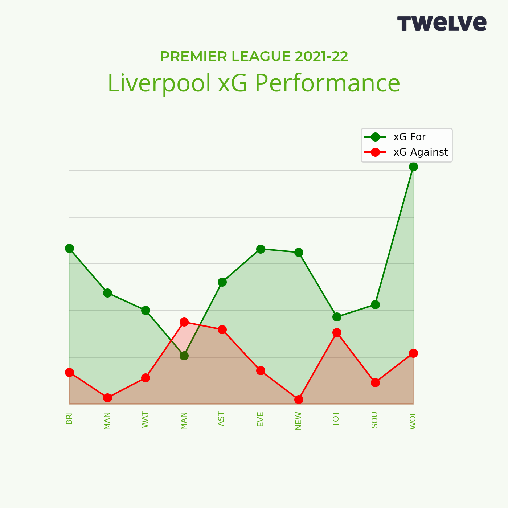

We will cover [expected goals](../lesson2/introducingExpectedGoals) in the next section,
but for now you can think of the area of the dots below as measuring the quality of a chance.
Notice that Liverpool mainly shoot from an area in the middle of the penalty area. 
They aim to create high quality chances. Their xG performance on is a
rolling presentation of expected goal differences for the 
last 10 matches. This shows they created better chances than their opponents in 
all but one of their matches (against Manchester City).

#### Entries in to the final third

Again building on expected goals, this visualisation shows the quality of chances Liverpool had when they entered the final third in 
various ways. Notice that balls arriving first on the wings (to Salah and Alexander-Arnold on the right,
and Mane and Robertson on the left) are most dangerous. Centrally, they are less of a risk. Turning to the entries against we see (of course) that their opponents enter 
Liverpool's final third less often, but are slightly more dangerous when attacking on the right.

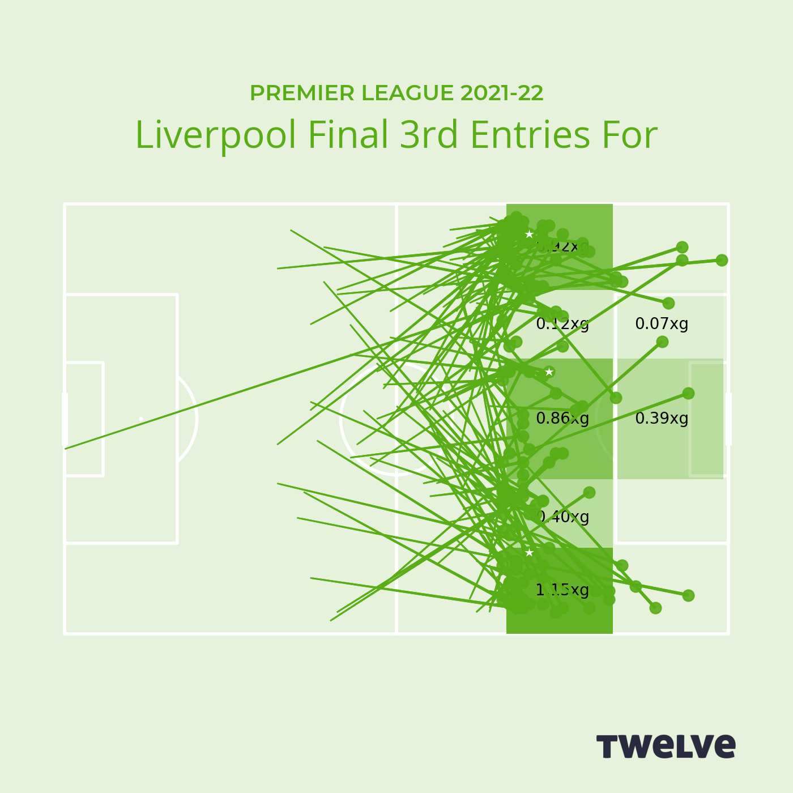
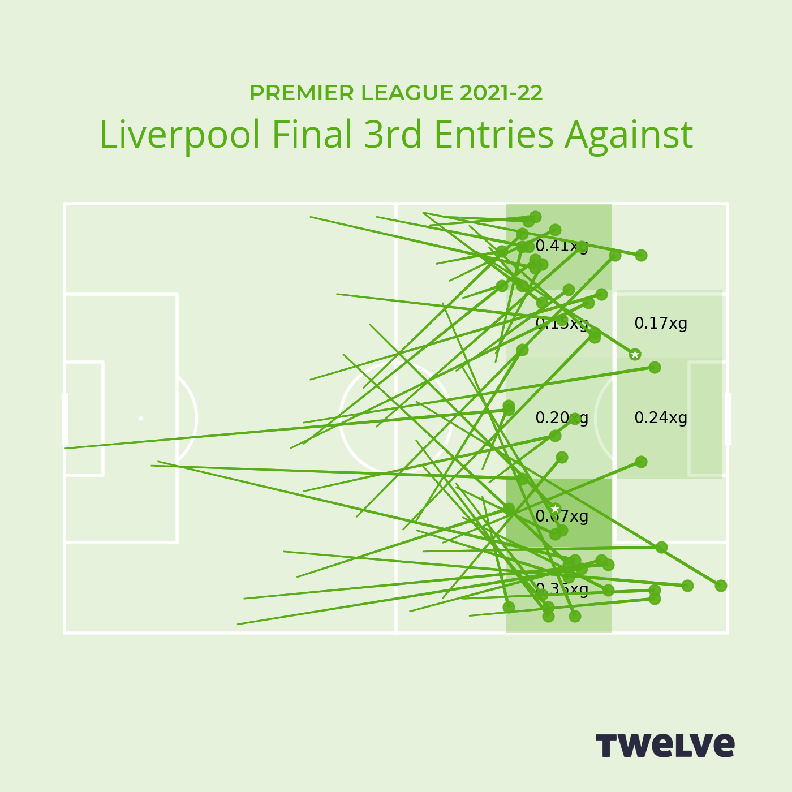

#### Transitions

An important part of Liverpool's game is pressing high up the field, regaining the ball and creating chances from this. 
The map on the left shows where they are making these regains and the quality of the chance they generate.
Again, area of the circle is quality of chance and a star indicates a goal. 
Slightly more of these successful regains occur on Liverpool's left wing than on the right. A striking aspect 
is how well they convert regains in their own half in to successful attacks.

Turning to the map on the right, we see that although other teams regain the ball 
from Liverpool while they are attacking, the opposition seldom create danger from these 
regains. It is very difficult to win the ball back from Liverpool in their half of the pitch!

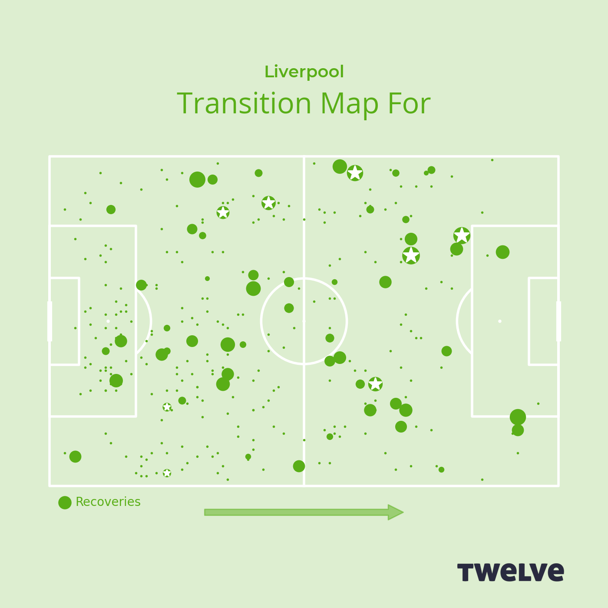
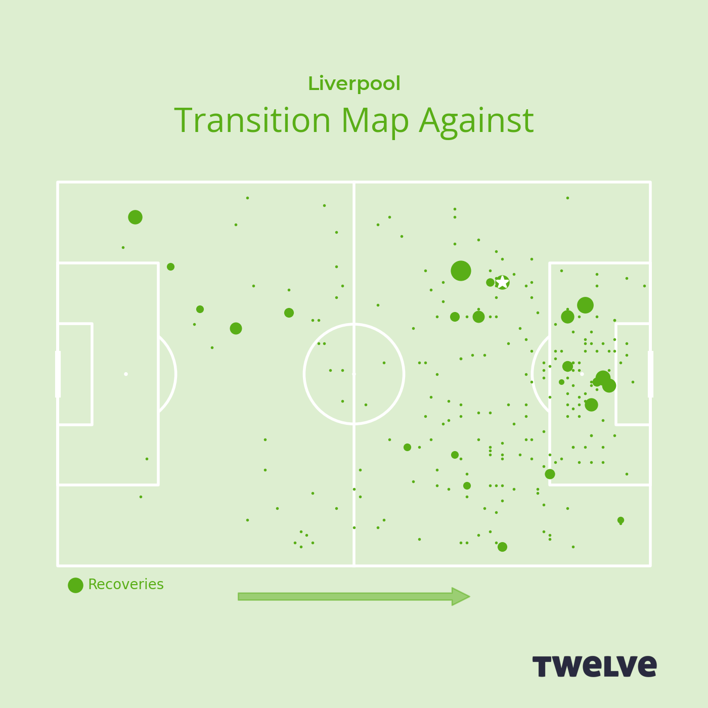

### Further Reading

Soccermatics, Chapter 7, The Tactical Map. 