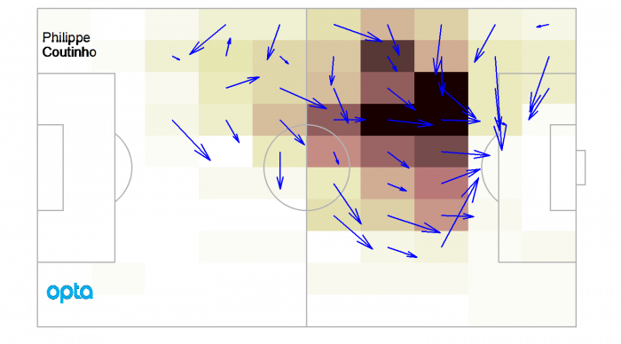
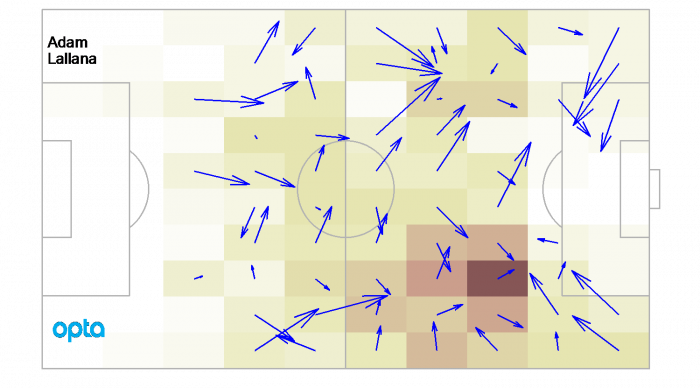
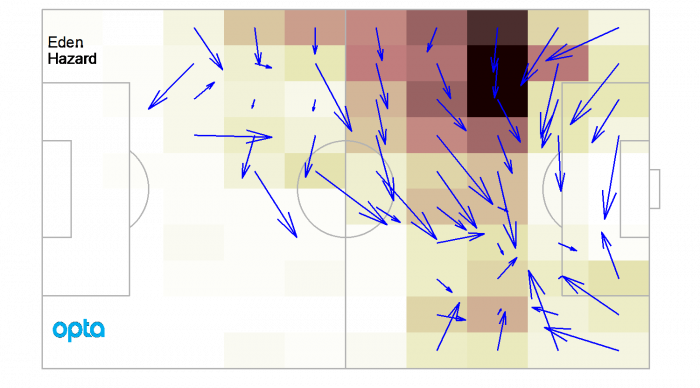
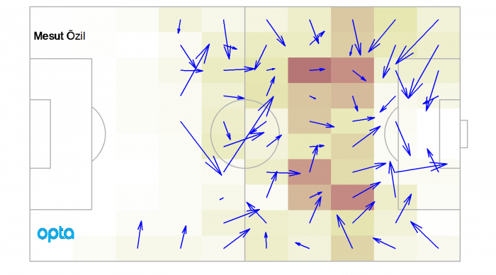
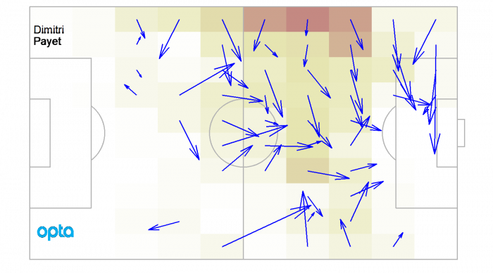
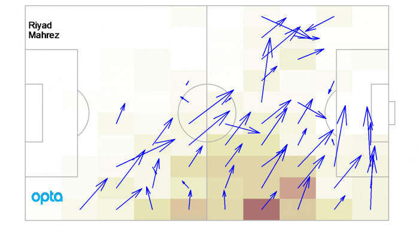

Case study: attacking play 
==========================

This text is taken from an article I wrote during the 2016-17 season. 
It nicely illustrates how heatmaps can be used to highlight differences between players.

### Summarising attacking play

Heat maps are especially useful in evaluating the first stages of the season, before a lot of goals have been scored or assists have been made. Goals occur much less often than passes, and teams are sometimes lucky or unlucky in the first part of the season. By looking at the passes we can find out where players are creating problems for the opposition.
Lets start with a player who Liverpool are missing just now, Phillipe Coutinho. The darker the area the more passes he has made per 90 minutes. The blue arrows show the average direction of his passes.

The dark area just in front of the box is where Coutinho is at his best. The forward pointing arrows show that he is moving the ball forward in to more dangerous areas. This is one of the most impressive passing heat maps in the Premier League. Lots of successful passes from dangerous positions.
A player who Liverpool were glad to have back in their starting line-up against West Ham was Adam Lallana. Here is a heat map of his passes so far this season.

Lallana also plays in attacking midfield, but unlike Coutinho he moves more freely around the pitch. Its interesting to note that many of Lallana’s passes feed in to exactly the area occupied by Coutinho. It was when these two were playing together that Liverpool were at their best this season.
To give some context to Coutinho’s ability to penetrate in front of the box, we can compare him to another master of attacking midfield, Eden Hazard.

Hazard is back on form this season, and makes a lot of passes from around the same area as Coutinho, but there are differences between these two players. Hazard’s passes tend to take the ball central, rather than forward. This reflects differences in Chelsea and Liverpool’s attack. The London team reply more on take-ons and dribbling to make the final move in to the box. Liverpool use one touch passing when attacking.
Probably the only player who produces more forward passes in front of the box than Coutinho is Arsenal’s Mesut Özil.

There is no other player in the Premier League who is able to consistently move the ball forward in to the penalty area as Özil. His heat map has consistently showed the same pattern since he arrived at Arsenal. The entire way that Arsenal play builds around Özil’s ability to find a way through the opposition from the area in front of the box.
Arsenal and Liverpool are possession intensive teams. Attacking midfielders for counterattacking teams typically have a slightly different role. Dimitri Payet’s passing heat map is shown below.

Payet’s passes come from further out on the wing and are longer crosses in to middle. This season, however, the arrows created by Payet’s passing don’t point forward to the same degree they did last season. West Ham United may well have got a draw against Liverpool, but they still aren’t creating in the same way they were last season.
As a final comparison, lets look at Leicester City’s Riyad Mahrez.

Leicester have not performed as well this season as last, but their result against Manchester City shows they are still dangerous. And Mahrez is still doing exactly the same thing this year as last: moving the ball forward and creating danger from the right wing.
Heat maps like these are most useful when you compare different players. Its then the patterns, both in terms of the tactics used by the teams and the individual skills of the players, are clearest.

### Thinks to think about

Heat maps are spatial histograms. Each square on the heat map shows 
the number of passes made by the player from that square. 
The ‘hotter’ the square, the more passes made. In the heat maps 
in this article I plot passes per 90 minutes. This means that the number of 
passes in each box are divided by the minutes played so far this season 
and then multiplied by 90.

There are lots of different heat maps that can be made of football. 
For example, we can look at where passes are received. 
This is a good way of assessing strikers, who make fewer passes but 
are often on the end of them. Defensive heat maps can also be made by 
looking at where players recover the ball.
One word of warning should be added about the blue direction of the 
average passes. A single average direction hides the fact if some 
passes are made to the middle of the pitch and some are made down the 
wing, then the average will be an arrow pointing toward the box. This 
does not mean that most passes go in to the box. 
