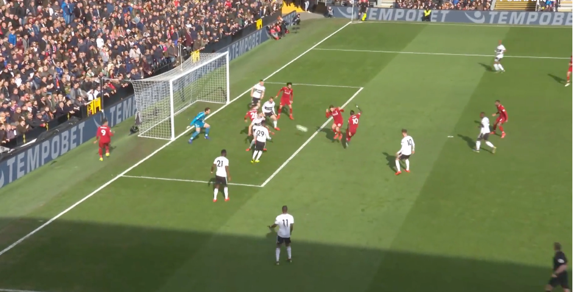
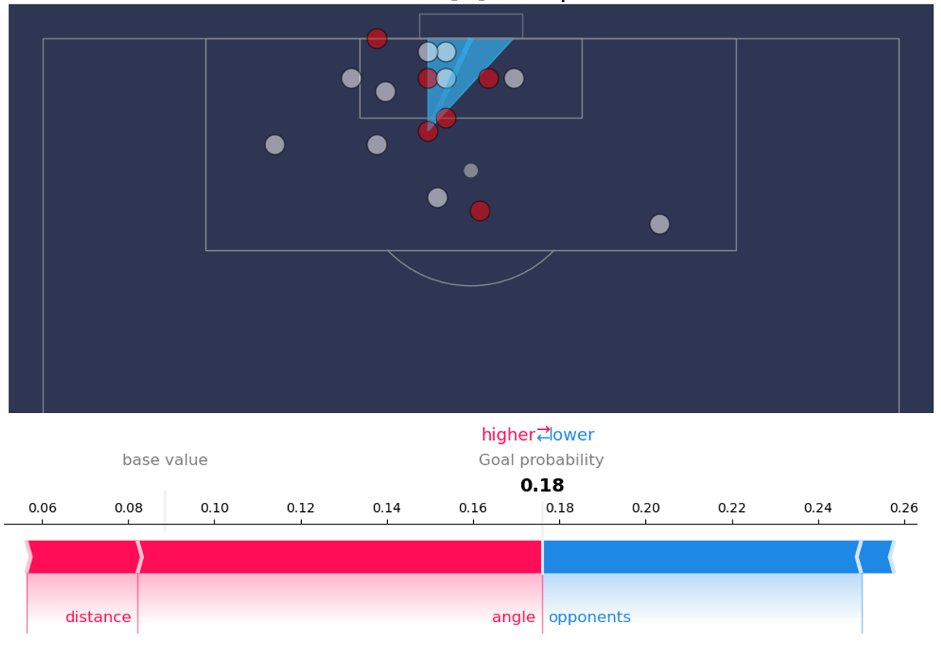
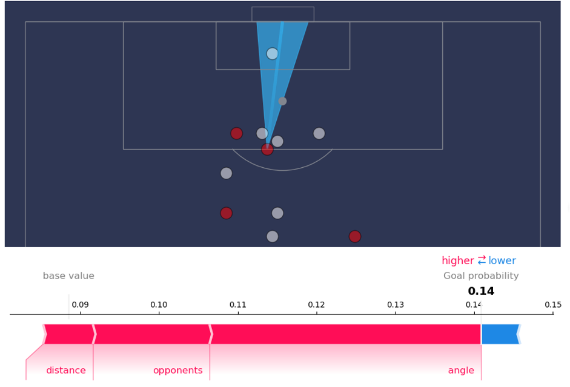
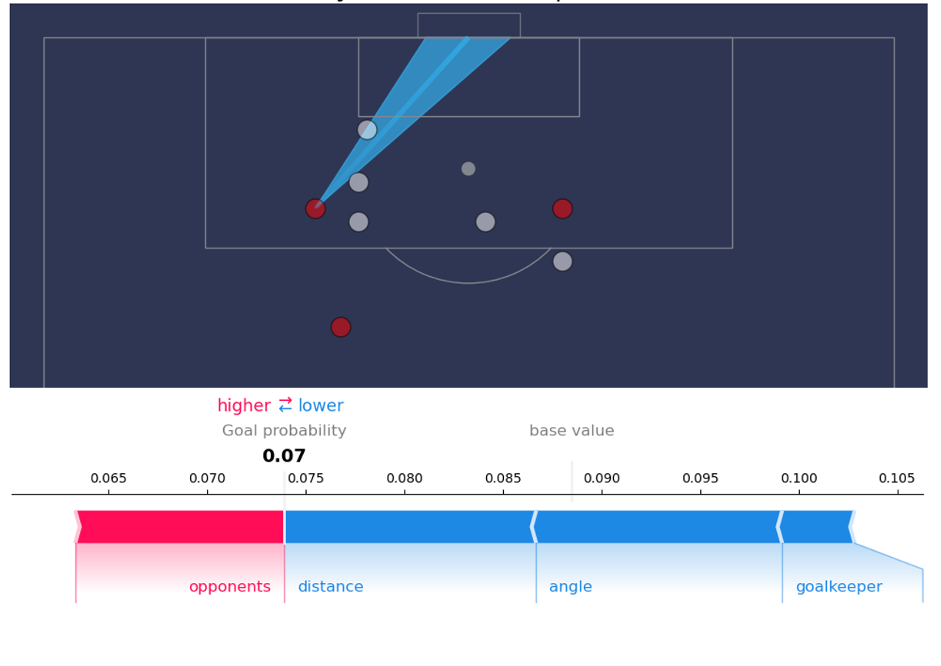

Case study: the geometry of shooting
====================================

### Talking to players aboout xG

In this video I talk about the principles of expected goals in relation
to how players see the game

<iframe width="640" height="480" src="https://www.youtube.com/embed/Xc6IG9-Dt18" title="YouTube video player" frameborder="0" allow="accelerometer; autoplay; clipboard-write; encrypted-media; gyroscope; picture-in-picture" allowfullscreen></iframe>

One of the key things to come out of this discussion as how a few steps towards inwards towards the middle of the box 
turns a 1% or 3% chance in to a 5% or 7% chance.

### Goal angle

A key principle in my approach to football analytics is to make sure that all data is related back to the game itself. We should never introduce a number, a statistic or a metric unless we can say what it means in terms of a player’s actions and coaching decisions. We have already seen this principle at play in Guardiola’s organization of resting defence, the way we evaluated Traore in terms of high-speed dribbles and space creation by Manchester United’s left-back, Luke Shaw.

We now look for the same principles in the way we use expected goals. Without these principles the numbers don’t tell us anything.

The first thing to consider when it comes to evaluating a shot is the view the player has of the goal: the more he or she can see, the better your chance of scoring. Players learn this early. They notice that if they overrun the ball in the box, they end up hitting the side netting. It also underlies the most basic advice for defenders: showing the attacking player the way out to goal line, to narrow down his angle. 

The goal angle idea is illustrated below. In (a) the angle at the point of shooting to two lines drawn to the posts in 38 degrees. For (b) and (c) it is 17 degrees. 

Note that moving out to the side is equivalent to moving further away from the goal. The same principle applies: the wider the angle between the goal posts the better the chance of scoring.

To calculate the goal angle, $θ$, I take the $(x,y)$ co-ordinate of the shot, 
where $x$ is distance along the edge of the pitch from the goal line and $y$ 
is the distance from the middle of the pitch. (0,0) is the point on the goal line in the middle of the goalmouth. 
The angle between two vectors pointing to the goal posts is:

$$ \tan(\theta) = \frac{7.32 x}{x^2 + y^2 - (7.32/2)^2} $$

The origins of this equation aren’t immediately obvious and it is a fun exercise in high-school trigonometry to derive it. Hint: 7.32 is the width of the goal!

### Reaction time

Another principle behind evaluating a shot is goalkeeper reaction time. Ajax sports scientist, Vosse de Boode, conducted experiments on goalkeeper reaction times and the time it takes to complete a dive to show that, “Goalkeepers are chanceless within a 16m of the goal, if [and this is a big if] a shot is placed in the top corner with maximum shot speed.”.

De Boode findings mean that close to the goal, it is in their own hands (or feet) whether or not they score. 
Combined with the goal angle, a non-linear effect is created whereby wider-angle shots are more valuable if they are closer. 
It is this effect which creates the squashed ring effect in the probability of scoring at different distances that we say earlier:

To calculate the probabilities we use logistic regression 
on the angle between a line drawn to the goal posts to predict the probability of a goal. 
This means that I assume that at points on the pitch where the angle is the same, 
the probability of a goal is the same. For the 55 degree angle in the top figure the 
probability of scoring is just over 30%. For the 17 degree angle it is just less than 6%. 
The larger the angle, the better the chance.

### Using this model as a guide to shooting

It is this picture (and de Boode’s advice about the top corner) 
that every attacking player should have in their head when making shot decisions.

One important discussion I have had with several players is about the 7% ring. 
One interpretation might be that a player should not shoot unless they are within this ring. 
This is wrong! Instead, the 7% ring tells us about how much a few steps closer to goal can 
increase the chance of scoring. For example, shots from the top corner of the penalty box are 2% chances. A few steps centrally can triple the chance of scoring.

Ted Knutson has written an excellent [article](http://statsbomb.com/2016/04/explaining-and-training-shot-quality/) 
on shooting position, providing a detailed analysis of where to shoot from.

Venezuelan engineer, Cesar Morales, has proposed that the [shape of the penalty area](https://www.researchgate.net/publication/301686656_A_mathematics-based_new_penalty_area_in_football_tackling_diving)
should be redrawn to look more like the squashed circle of shooting success.

### Different teams, different xG strategies

Looking at data from 2017, we see that Barcelona are specialists in creating chances close to goal with high shot quality. Here are shots for Messi, Neymar and Suarez last season. The black circles mark shots that went in.

Messi is the only of the three attacking players who shoots from further out, and his longer distance efforts tend to be reasonably central

Real Madrid on the other hand focus on shot volume. Here are shots and goals by Bale, Benzema and Cristiano Ronaldo last season.

Different teams adopt different strategies for shooting, but it is important that all players understand the trade-offs involved in having a go from further out and/or from more difficult angles. When Ronaldo scores from outside the box there is 100% probability we see it on the match highlights. But we shouldn’t forget that for every one of his long distance goals he fails to score about 30 times.

## Including the goalkeeper

Up to now, we have ignored a very important factor which determines if a shot is a goal or not: 
the defending players and the goalkeeper! We can account for these in expected goals model, using tracking data.  
We can also, using a machine learning model, measure how these factors combine with distance and goal angle in determining the probability of a shot’s success.

In the example below, Sadio Mane has a very large angle and a short distance, but has serveral opponent players between the goal and his position.

Twelve data scientist, Jernej Flisar has developped a method based on, what is known as Shapley values, 
to calculate how much different factors contribute to the quality of a chance. In this example, 
distance and angle (in red) are positive contributions. 
The number of defenders between the Mane and the goal (in blue) are negative contributions.

Without the opponents in the way, this would have been a 0.25xG chance, but with the opponents it drops to 0.18xG. Mane scored this chance with a cheeky flick of the side of his foot.

Further examples below illustrate the principles behind this approach. This longer distance
effort has higher xG because of a favourable goal angle and although the opponents are nearby, they are not significantly in the way of the shot.

In the final example, below, the angle and distance both make the shot less likely to result in a goal than average, although lack of opponents in path of the shot improves the opportunity somewhat.

Our approach to expected goals, based on angles, distances and the positioning of the players, can be used to talk to players about their decision-making: how important it is to have a clear sight on goal? what is the value of beating one more player before shooting? why is the top corner so important? Different scenarios can be presented and discussions can be let to evolve around how to create better shooting locations. Expected goals ensures that these discussions are based in facts and data, not in speculation.

The approach is also useful in scouting and opposition analysis. Some players  over-perform (score more goals than xG predicts) in certain type of shooting situations: maybe a player is better at scoring even in a crowded box or can score from narrower angles. In the latter case, defenders should be aware that allowing that player to run wide might not be the advantage it usually is.

Used in this way, expected goals is so much more than just a count of chances. It is a deep understanding of the geometry of shooting.
