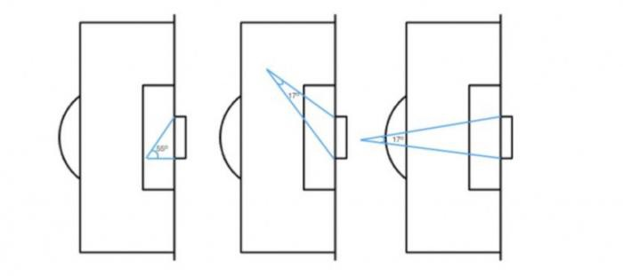
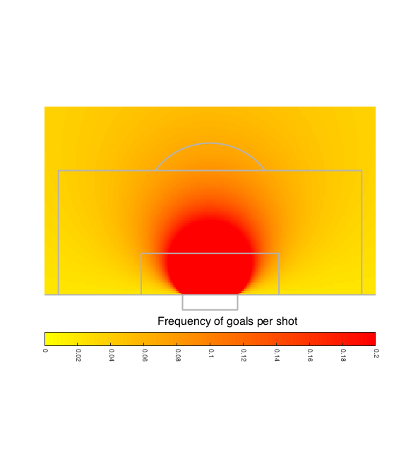
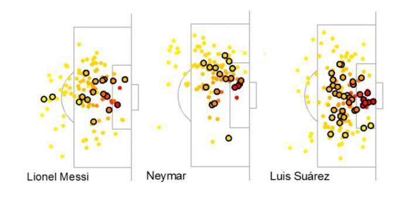
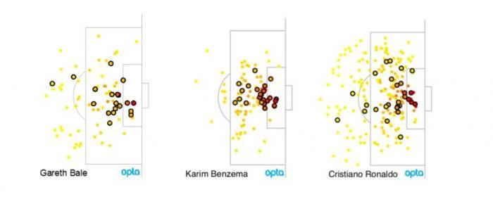

Case study: the geometry of shooting
====================================

In this video I talk about the principles of expected goals in relation
to how players see the game

<iframe width="640" height="480" src="https://www.youtube.com/embed/Xc6IG9-Dt18" title="YouTube video player" frameborder="0" allow="accelerometer; autoplay; clipboard-write; encrypted-media; gyroscope; picture-in-picture" allowfullscreen></iframe>

One of the key things to come out of this discussion as how a few steps towards the box turns a 1% or 3% chance in to a 5% or 7% 
chance.

## From playground to training ground

The mathematics of football isn’t difficult. Young players learn the geometry of the game even before they encounter the subject in the classroom.
Think about angles and shooting. Here is the rule: the more of the goal you can see when you shoot, the better your chance of scoring. Players learn this at seven or eight. They notice that if they overrun the ball in the box, they end up hitting the side netting. Ten-year-olds learn to defend by reducing the angles: showing the attacking player the way out to goal line. Even primary school kids can calculate the angles for scoring and defending goals.
The rules for shooting are mathematical, even if we don’t always notice it. The figure below shows three different shooting positions and the angles between the goal posts.

In the left-hand example the angle is 55 degrees, giving a very good chance of a goal from here. In the middle and right-hand figures the angles are both 17 degrees, providing much narrower chances.

Football analytics should take what we know about the game and gain insight by looking at it more thoroughly. We use maths and data to find an edge. Below I show shot success statistics in terms of the angle to the goal post shown above.

Now we have moved from a training ground discussion with kids, to using Opta’s shot data over the last two seasons. The more red the colour, the higher the probability a shot went in from this position during the past season. Shots from the bright red area have at least a 20% chance of going in. The circle marked by the colour change from yellow to orange is where the probability of scoring is around 5%. Further out the probability of scoring drops off dramatically.

To calculate the probabilities I have fit a statistical model where I use the angle between a line drawn to the goal posts to predict the probability of a goal. This means that I assume that at points on the pitch where the angle is the same, the probability of a goal is the same. For the 55 degree angle in the top figure the probability of scoring is just over 30%. For the 17 degree angle it is just less than 6%. The larger the angle, the better the chance.

The analysis above is the starting point for expected goals models, which we will look at in depth in this series. For now, we can take our analysis one step further by including distance to goal and distance to centre of the pitch in our model. Doing this, we get the following picture of the probability of scoring for different points around the box.

This is a more nuanced, and more accurate, picture of shooting success. Instead of the circles we found when we looked only at the angle to the posts, we get a sort of squashed out circle. In practice, this tells us that shooting from a bit wider out can still result in a goal.

Barcelona are specialists in creating chances close to goal with high shot quality. Here are shots for Messi, Neymar and Suarez last season. The black circles mark shots that went in.

Messi is the only of the three attacking players who shoots from further out, and his longer distance efforts tend to be reasonably central

Real Madrid on the other hand focus on shot volume. Here are shots and goals by Bale, Benzema and Cristiano Ronaldo last season.

Different teams adopt different strategies for shooting, but it is important that all players understand the trade-offs involved in having a go from further out and/or from more difficult angles. When Ronaldo scores from outside the box there is 100% probability we see it on the match highlights. But we shouldn’t forget that for every one of his long distance goals he fails to score about 30 times.

## Further reading
Ted Knutson has written an excellent [article](http://statsbomb.com/2016/04/explaining-and-training-shot-quality/) 
on shooting position, providing a detailed analysis of where to shoot from.

Venezuelan engineer, Cesar Morales, has proposed that the [shape of the penalty area](https://www.researchgate.net/publication/301686656_A_mathematics-based_new_penalty_area_in_football_tackling_diving)
should be redrawn to look more like the squashed circle of shooting success.

## Calculating goal angle

To calculate the goal angle, $θ$, I take the $(x,y)$ co-ordinate of the shot, 
where $x$ is distance along the edge of the pitch from the goal line and $y$ 
is the distance from the middle of the pitch. (0,0) is the point on the goal line in the middle of the goalmouth. 
The angle between two vectors pointing to the goal posts is:

$$ \tan(\theta) = \frac{7.32 x}{x^2 + y^2 - (7.32/2)^2} $$

The origins of this equation aren’t immediately obvious and it is a fun exercise in high-school trigonometry to derive it. Hint: 7.32 is the width of the goal!

