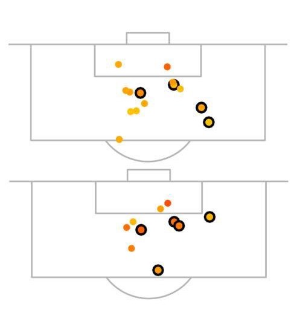

History and application of xG
=============================

### The ultimate guide

I created a video for Friends of Tracking where I go through the
history of expected goals, explain how they are used and how they work.
Watch it!

<iframe width="640" height="480" src="https://www.youtube.com/embed/310_eW0hUqQ" title="YouTube video player" frameborder="0" allow="accelerometer; autoplay; clipboard-write; encrypted-media; gyroscope; picture-in-picture" allowfullscreen></iframe>

### What do xG really tell us

Expected goals are not football’s magical equation. They are a starting point, but we also need to think about the limitations of this technique.
Lets first re-iterate what expected goals are useful for: expected goals are a measure of whether a team is generating good chances and talking to 
players and coaches about what makes a good chance. 

However, expected goals are not the only way to measure chances. It may seem like stating the obvious, 
but we shouldn’t forget that another very valid way of assessing how well a team is playing is to actually watch their matches!
When StatsPerform/Opta collect data on shots their operator makes a note of whether he or she considers a shot to be a Big Chance. 
What makes a shot or header a Big Chance is difficult to define, but most of us know when we see one. And the Opta 
operators receive training to make sure they are consistent as possible in how they categorise shots.

These human assessed Big Chances are a pretty good measure of the probability of a goal being scored. 
In fact, they are just as good as expected goals based on event data. 
Humans are as good as statistics at evaluating the quality of chances a team is creating. 
The plot below compares Liverpool’s big chances in the first seven weeks of the Premier League season 2017-18, along with their chances that had an expected 
goal value above 20%. The black circles indicate a goal.

There are differences in the categorisation, but these are quite small. To test the relationship between 
big chance and expected goals, I fitted two models, one based on human observation and the other on data, 
using logistic regression. The first model was the probability of scoring as a function of 
whether a shot was a big chance. The best fitting model was
$p( \mbox{goal} | \mbox{not Big Chance}) = 0.055$  and $p( \mbox{goal} | \mbox{is Big Chance}) = 0.388$
This model had $R_\mbox{squared}=0.159$. The best fitting model for the probability of scoring included the following factors: 
distance to goal line, distance to middle of the pitch, whether attack was a fast break, whether shot came from a corner, 
whether the effort was strong or weak, whether it arose from a volley or half-volley and if it came from individual play. 
Despite having many more parameters, this model had an $R_\mbox{squared}=0.159$, only slightly larger than the Big Chance model. 
Jan Mullenberg goes on to look more closely at 
this comparison [here](http://www.tussendelinies.nl/expected-goals-uitgelegd).

### How to use xG to assess a team early in the season

Following on from such examples, and a more in-depth statistical analysis of xG, 
I have developed some rules of thumb for using xG to measure performance during a footballing season. 
They are as follows:

**1 or 2 matches**: When discussing one or two matches to stick to talking about the match: what happened, tactics adopted, players’ movement, etc., and speculate less about what xG means about the team in the long term. Expected goals tell us little more than the scoreline itself. While it might feel a bit better to say, after a big loss to a rival, that ‘we won on xG’, I’m afraid that single match xG is still very random.  

 

**3 to 6 matches**:  They give us a clear picture of a team only if they consistently lose or win. If xG and goals tell a different story then it is time to ask if a team might not be quite as bad (or good) as they seem.

 

**7 to 16 matches**: This is the most exciting time for using xG. Now goals are becoming a more reasonable measurement of performance. It is difficult to sustain a 10-match lucky streak and you don’t really expect to have a 10-match bad run unless the team is poor. So if xG and goals contradict each other then it is important to highlight this in the analysis.

 

**More than 16 matches**: I once told a club analyst, whose team had over-performed xG for a whole season, that this was probably because his team was actually good. I’m not sure he was convinced, but he should have been. After 16 matches, the difference between the noise in xG and the noise in real goals is small. But expected goals are a mathematical model, while goals are reality. So, expected goals tables become less relevant in evaluating a whole season and we should concentrate on real goals.

Clubs often use rolling averages of expected goals to measure the evolution of their performance and we will come back to these later. 

Work by [Ben Torvaney](https://www.statsandsnakeoil.com/2021/06/17/xg-vs-goals-time-discounting/) 
has shown that around a 10-game window is the best way to exploit xG as a predictor of attacking and defensive success. 
This is a very good tool, for example for the board of a club to keep an eye on how things are going. 
What xG numbers do not do, however, is explain why things are going well or badly. For that, we always need to go deeper.

