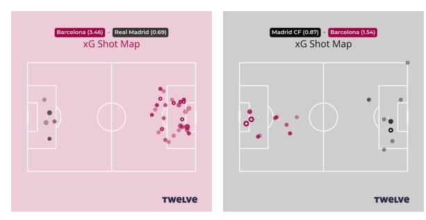
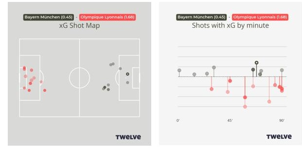

Introducing expected goals
==========================

### What are expected goals

Expected goals (or xG) are the best-known metric in football analytics. 
They measure the quality of a chance created. When we say that a shot had an xG of 0.2 (or 20%), 
we mean that typically shots of this type will be scored 20% of the time. They can be thought of as
the probability that on a typical day of football a particular shot from that 
location would result in a goal. 

As we have already seen, the two most important factors involved in determining the xG value of a shot are the 
distance to the goal and the amount of the face of the goal the shooter can see. Oblique angles 
from the side of the goal are harder to score from, and angles in front of the goal are easier. 

Other factors such as if the shot is taken with the player’s best foot (or with the head), 
if the assisting ball was from a cross or cutback, the position of defenders and goalkeeper 
(when we have tracking data), and so on are also important in determining xG of a chance. 
The percentages also differ slightly (although not very much) for women and men, and between leagues. 
But the most important rule is that, the closer an attacker gets to the goal and the more of the goal she can see, 
the better the chance she has of scoring.

### Match reports

The most common context in which xG is discussed in the media is in summarizing a single match. 
Here is an xG map for recent Primera Division matches where FC Barcelona met Real Madrid and Madrid CFF. 

Each circle is a shot. The intensity of the color of each circle is proportional to the xG of that shot.
A star indicates a goal. We see here that FC Barcelona dominated the match against Real Madrid 
(they scored 4 goals from an xG of 3.46) and were less able to create high-quality chances in the 
away visit to Madrid CFF. In both these cases, the scoreline and the xG told the same story as each other: 
a big win in the first match and a tighter game in the second. 

### Care in how we interpret the numbers

While xG is a valuable tool, like all statistics or performance indicators, we have to think about what
they are really telling us. It isn’t simply the case that the team with the highest xG was the worthy winner of the match. 

Take, for instance, a hard-fought match in the Champions League qualifiers between Bayern Munich and Lyon.
Bayern won 1-0, but recorded 0.45-1.68 in xG. 

 

We might be tempted, on the basis of xG, to say that Lyon should have won. But… if we 
look carefully at the time of events, we see that Lyon had two very good chances 
(with a total of 0.7xG) in the 58th minute. Both of these fell to Catarina Macario, 
one where the ball came slightly behind her, making it hard to shoot before the keeper got back.

The second was the rebound, after the keeper saved, which Macario failed to control.

It was these two events, where very small margins determined the outcome, that 
contributed nearly half of Lyon’s xG total. Therefore, the xG tells us 
little more about the scoreline than the result itself. We can’t say that Lyon should have won, 
only that it was a close match.

