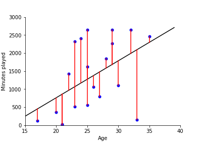
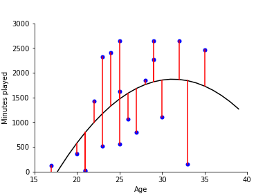
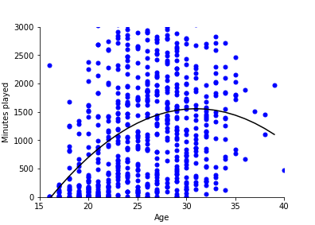
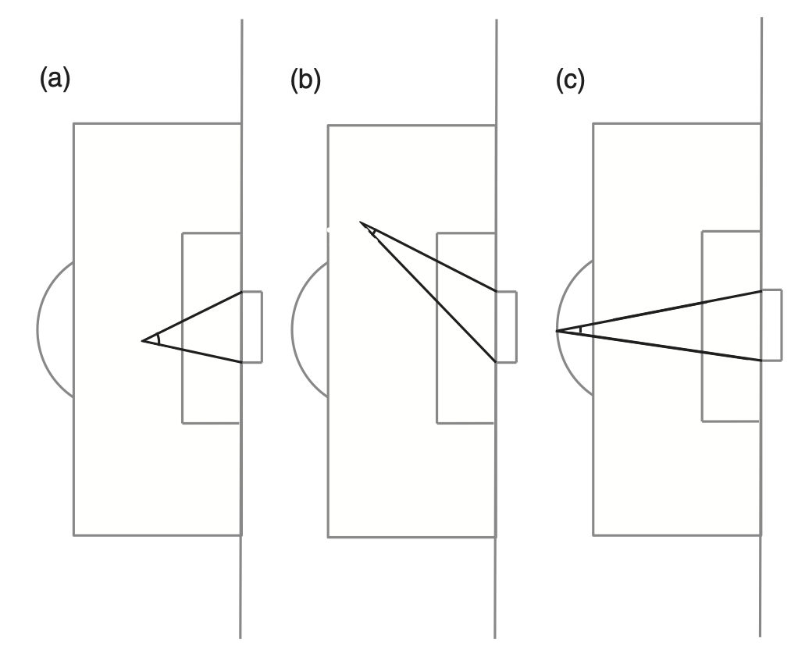
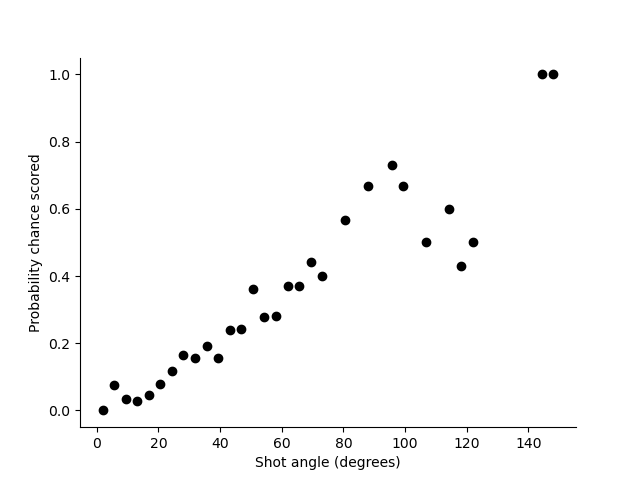
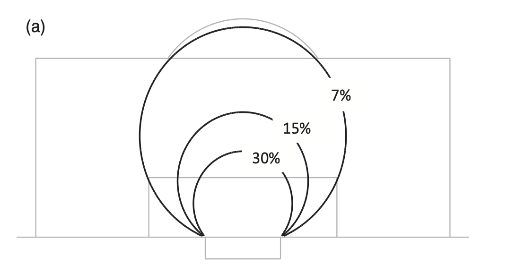
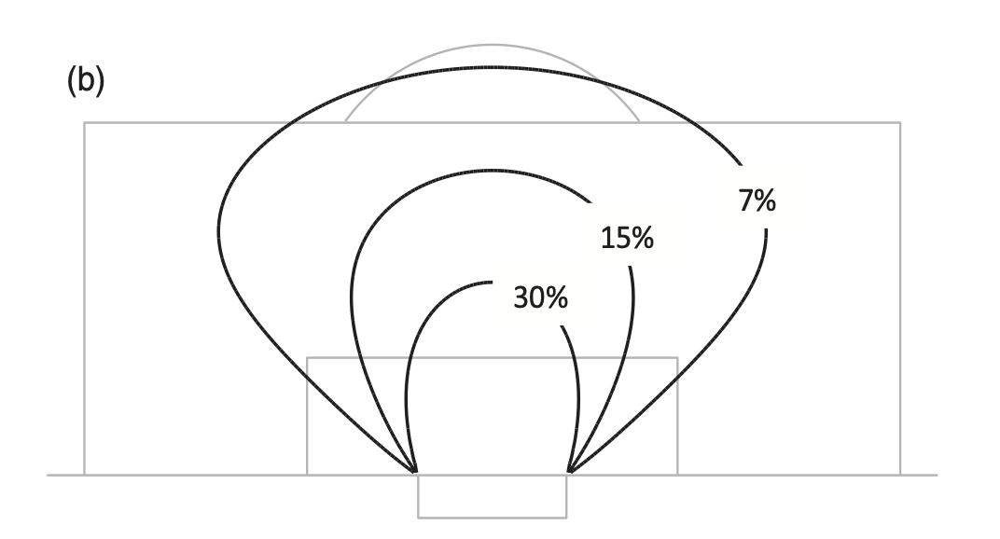
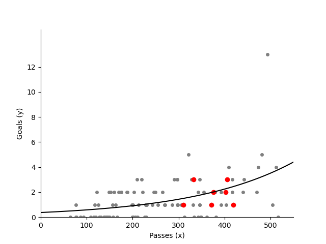

Statistical models
==================

VIDEO HERE

### Choosing the right model

Over the last decade there has been an incredible transformation in 
the teaching of University statistical modelling. In Uppsala, I have gone 
from teaching stats to four or five very dedicated Masters students, 
to providing the same type of material, rebranded as machine learning, to several 
hundred students per year. This is, of course, a positive development. More people are
learning advanced statstical methods. 

But it also raises challenges. It used to be the case that students learning, for example, 
logistic regression would first have a thorough grounding in statistical theory, maximum likelihood 
estimation, hypothesis testing and so on. This is no longer the case. Practitioners want to be able 
to open up a toolbox like Scikitlearn (the Python library), put in their data and find a 
relationship in that data. They want answers quickly.

I don't want to go back to the days where statistical modelling was 
the domain of the few, but I do (in this section) want to give an overview of some of the things 
to think about when building statistical models. Most of these points will come back to one 
thing: **when we build a statistical 
model, it is to capture our understanding of football**. In other words,
all modelling we do should come back to the game. 

The challenge then is that we have to be able to translate 
that understanding of the game in to the appropriate statistical 
model. 

### Linear regression

Linear regression is a sort of default for finding relationships in data. 
In many ways this is an historical artifact because,
before we had computing power, it was the easiest way to calculate 
relationships in data. But it also has an advantage 
that it provides simple, explainable results of the form

$$Y = \underbrace{\beta_0 + \beta_1X_1 + \beta_2X_2 + \cdots + \beta_pX_k}_{f(X;\beta)} + \epsilon$$

where the (output) variable $Y$ is a found as combination of $k$ input variables 
$X_1, \dots, X_k$ plus some noise/error $\epsilon$. 

In the section  [linear regression](../gallery/lesson2/plot_LinearRegression)) we 
show how to fit a straight line by minimises the least squared distance between 
points and the line. In the example, we look at how the minutes played by a player increases with age.

$$\mbox{Minutes Played} = \beta_0 + \beta_1 \mbox{Age}$$

The fit of the model is shown below:

The parameter fit is made by solving the least squares problem, that is,
minimising

$$\sum_{i=1}^n (\beta_0 + \beta_1 x_i - y_i)^2$$

For only one variable, as in the example above,
this estimate is obtained by:

$$\hat{\beta_1} = \frac{\sum_{i=1}^n (x_i - \bar{x})(y_i - \bar{y})}{\sum_{i=1}^n (x_i - \bar{x})^2}$$

where $\bar{x}$ is the mean of the input variable and
$\bar{y}$ is the mean of the output variable.

The R-squared of the fit (for a single variable model) is then

$$ R^2 =1 - \frac{\sum_{i=1}^n (\beta_0 + \beta_1 x_i - y_i)^2}{\sum_{i=1}^n (y_i - \bar{y})^2}$$

The higher the value of R-squared, the more of the data is explained by the model

In the general case, where ${\bf X}$ is a matrix then we minimise

$$\widehat{\beta} = \underset{\beta}{\text{argmin}} \|{\bf X} \beta-{\bf y}\|_2^2$$

where $\beta$ is a vector of parameters. This is achieved with

$$\widehat{\beta} = \left({\bf X}^T{\bf X}\right)^{-1} {\bf X}^T {\bf y}$$

In this case, ${\bf X}^T{\bf X}$ is like sum of squares (similar to co-variances of input variables) 
and ${\bf X}^T {\bf y}$ is similar to co-variance between input and output. 

For example, we find that we can improve the fit (reflecting how older players play less) by including a quadratic term 

$$\mbox{Minutes Played} = \beta_0 + \beta_1 \mbox{Age} + \beta_2 \mbox{Age}^2$$

Giving the following fit:

A model like this becomes more useful when fit over large number of data points. 
Above, we looked at only 20 players. Here we fit to all the players in the 
[FBREF database for La Liga 2020-21](https://fbref.com/en/comps/12/2021-2022/stats/2021-2022-La-Liga-Stats).

A model like this helps us get a quick understanding of messy data points. We see, for example, that 
after 30 years-old, playing time starts to decrease. Maybe something to think about before signing an
apparently hot 29-year-old?

This is (of course) just an example. The main advantage of linear regression is that it gives 
a quick way of getting at relationships in data. 

### Logistic regression 

Is used when we want to know the probability of an event occurring or not occurring. 
It is for 'yes' or 'no' answers: 'goal' or 'not a goal','successful pass' or 'failed pass'
, 'successful dribble' or 'failed dribble'. 

A logistic regression model has the form

$$p(Y=1 \mid x_1, ... , x_n ) = \frac{1}{1 + \exp(-(\beta_0+\beta_1x_1 + .. + \beta_n x_n))} $$

where $x_1, ... ,x_n$ is a list of features and $Y$ is the event to be predicted 
($1$ means it happens,
$0$ means it doesn't). So, $p(Y=1 \mid x_1, ..., x_n)$ means the probability event $Y$ 
occurs given features $x_i$.

To illustrate this with a practical example, 
lets look at the most famous use of a 
logistic regression model in football modelling: The expected goals model. 
In this case, $Y=1$ means a goal 
has occurred from a shot; $Y=0$ means a goal has not occurred. Now lets take the feature 
to be the goal angle as illustrated below.

The angles shown in these images, between the lines directly to the 
goalposts from the point of a shot, 
gives a measure of how much of the face of the goal the striker can see. Plotting (binned) 
data from one season we see the following relationship.

Taking this angle as the feature the model we want to fit is:

$$p(\mbox{Goal}) = \frac{1}{1 + \exp(-(\beta_0 + \beta_1 \mbox{Angle}))} $$

The aim in fitting this model is to find the values of $\beta_0$ and $\beta_1$,
which maximises the likelihood of the data given the model. The way the likelihood is calculated
is illustrated below:

When we then take the fitted values of $\beta_0$ and $\beta_1$ and plot them on a pitch
with contours showing the probability of scoring we get the following plot.

The probability of scoring a goal is also similar for the different points 
on these circles. Around 15% of shots taken with an angle of 38° 
and 7% of shots with an angle of 17° result in a goal. There is a 
remarkable reliability in this geometrical football rule. 
I have looked at shooting data from the Premier League, Bundesliga, 
La Liga and Champions League, and worked out the probability of a goal from different points. 
The results are always similar: the angle between the goal posts, as
seen by the player taking the shot, is roughly proportional to the probability of scoring.

The art of fitting a model lies in choosing features that are related to football 
and using statistical techniques to know whether a feature should be included. In the
[expected goals model](../gallery/lesson2/plot_xGModelFit) section we look at 
both distance and goal angle and non-linear combinations of these two. From this 
analysis we find that a circle isn’t quite the right shape to describe the 
probability of scoring. The best shape is a little bit more squashed out at the sides, like in this 
model I fitted when I wrote Soccermatics (the book).

The fitted model in this case is:

$$p(\mbox{Goal}) = \frac{1}{1 + \exp(\beta_0 +\beta_1 \mbox{Angle} + \beta_2 \mbox{Distance} + \beta_3 \mbox{Angle} \cdot \mbox{Distance}+ \beta_4 \mbox{Distance}^2)} $$

Notice that, just like in linear regression, I use non-linear (products and powers) combinations
of the variables.

When I made this fit I added additional points to the data set with co-ordinates on 
the goalline where every shot failed to be scored. This approach (which is necessarily 
subjective) can be useful because of the nature of the data. Footballers tend to shoot more often 
from positions they are likely to score. And we know that certain types of shots are (in most situations)
doomed to fail. But we don't have that information in the data set. By adding (fake) data
we can help avoid overfitting.

This last point comes back to our golden rule: all the maths, statistics and machine learning
we do has to come back to football. This makes creating statistical models just as much an 
art as a science.

### Poisson regression

When the predicted variable occurs infrequently it is best to use Poisson regression. 
We will come back to the Poisson distribution in lesson 5, 
but for now the plot below shows how the rate of a team scoring increases
as a function of the number of passes they make.

In [statistical modelling](../gallery/lesson2/plot_PassCompare) we show how
to do Poisson regression.

### Other machine learning methods

The advantage of the methods above is that 
the result of the model fitting is that we have an equation that explains
the relationship in the data. This relates back to the key idea of 
'capturing our understanding of football' with our model. 
We will see this, for example, when we
plot probability of scoring as a function of distance from goal in the lesson on fitting
an [expected goals model](../gallery/lesson2/plot_xGModelFit). The methods above, 
also typically have ways of quantifying
that relationship (P-value, Bayes factor, explained variance etc.). 

When we use 
other machine learning methods --- xG boost, neural networks, etc. ---
then such understanding is not immediately available from the model fit. It is possible 
to obtain the understanding using various methods, but the advantage of thinking 
first in terms of the three models above is that they all have an easy (once you have
got the hang of it) to interpret form. We can use them to discuss our results 
with coaches! 

All of this said, we will come back to more complex methods in lesson 4.

### Further reading

For the basics of machine learning, we 
recommend [Machine Learning - A First Course for Engineers and Scientists](http://smlbook.org)