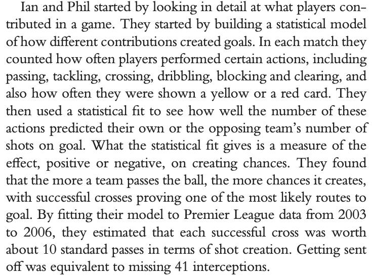
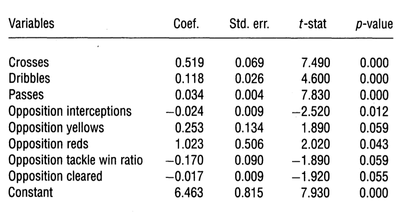
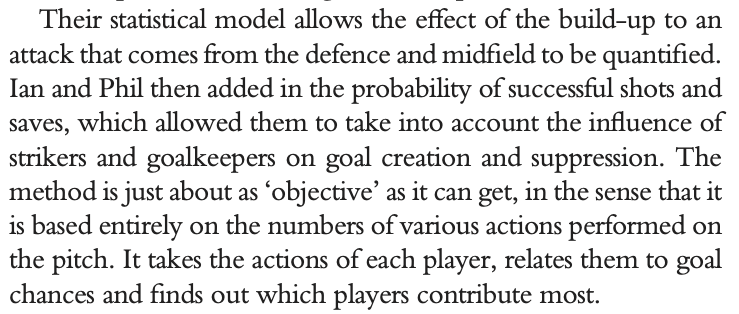
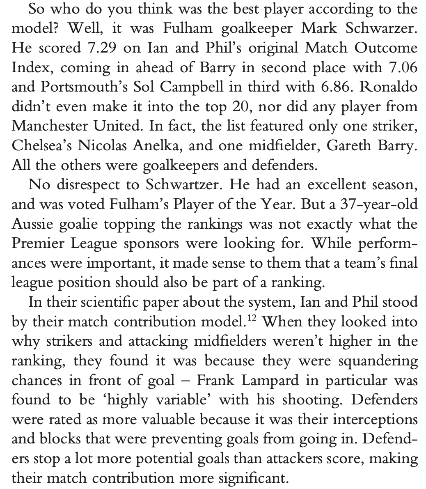

Other approaches to scouting
============================

One of the most straightforward ways of assessing players without looking in detail at
their actions is to look at the rate at which their team scores/concedes when they are on the pitch 
and when they are not on the pitch. This is the basic idea of plus-minus models, which are detailed in this video.

<iframe width="640" height="480" src="https://www.youtube.com/embed/Qxy72wzNT_M" title="YouTube video player" frameborder="0" allow="accelerometer; autoplay; clipboard-write; encrypted-media; gyroscope; picture-in-picture" allowfullscreen></iframe>

The video also covers an approach based on 

### Plus/minus models

Garry and Lars talk here goes deeper in to plus/minus rankings, as well as giving an 
excellent background on ranking models. 

<iframe width="640" height="480" src="https://www.youtube.com/embed/j5ybADC2gC4" title="YouTube video player" frameborder="0" allow="accelerometer; autoplay; clipboard-write; encrypted-media; gyroscope; picture-in-picture" allowfullscreen></iframe>

Garry passed away a few months after this presentation. He is sorely missed by the analytics community.

**References** 

Kharrat, Tarak, Ian G. McHale, and Javier López Peña. "[Plus–minus player ratings for soccer](https://www.researchgate.net/profile/Ig-Mchale/publication/317614652_Plus-Minus_Player_Ratings_for_Soccer/links/5b295cdba6fdcc72dbee586b/Plus-Minus-Player-Ratings-for-Soccer.pdf)" European Journal of Operational Research 283, no. 2 (2020): 726-736. (Links to an external site.)

Hvattum, Lars Magnus. "[A comprehensive review of plus-minus ratings for evaluating individual players in team sports](https://sciendo.com/downloadpdf/journals/ijcss/18/1/article-p1.pdf)" International Journal of Computer Science in Sport 18, no. 1 (2019): 1-23. (Links to an external site.)

### Evaluating actions

In [Soccermatics](https://www.amazon.co.uk/Soccermatics-Mathematical-Adventures-Pro-Bloomsbury/dp/1472924142/ref=sr_1_1?crid=1O6PV4A5TEQC2&keywords=soccermatics&qid=1662537339&sprefix=soccermatics%2Caps%2C146&sr=8-1), I write about the work of Ian McHale and Philip Scarf in the development of the 
Premier League Performance Index. 

The way they did this was to perform a linear regression on how the number of particular actions
impacted the number of goals. Below is the regression output for the model,

The regression co-efficients here show the relative importance of different factors in determining scoreline. Players 
are then rewarded for performing actions, weighted with these co-efficeients.

They tested it on the 2008/09 season to determine the best players. 
They looked at how many of the various types of action each player performed during the season, 
and calculated the index for each of them. This was Cristiano Ronaldo’s last season at 
Manchester United, where he was top goalscorer; Rio Ferdinand, Nemanja Vidic ́ 
and Ryan Giggs all made key contributions to the side. 
Liverpool made a serious title challenge, with Jamie Carragher, Steven Gerrard and Dirk Kuyt as regulars. 
Gareth Barry and Gabby Agbonlahor helped Aston Villa qualify for Europe.

More than ten years on, I think these methods are limited and have been superseded by the methods
we will see in lesson 4, where we look how actions value is determined by where they happen on the pitch.
But it is a useful starting point for more recent methods.

**References** 

McHale, Ian G., Philip A. Scarf, and David E. Folker. "[On the development of a soccer player performance rating system for the English Premier League](https://pubsonline.informs.org/doi/pdf/10.1287/inte.1110.0589?casa_token=RiPPGSTwdOMAAAAA:BBJqhu515QThbopaZH2Qmc4tS73hk2FmXVmQs1Z1WaX_r-UIJrjQU56EDvzfQp_HHUCRsjg3IcQ)" Interfaces 42, no. 4 (2012): 339-351.

