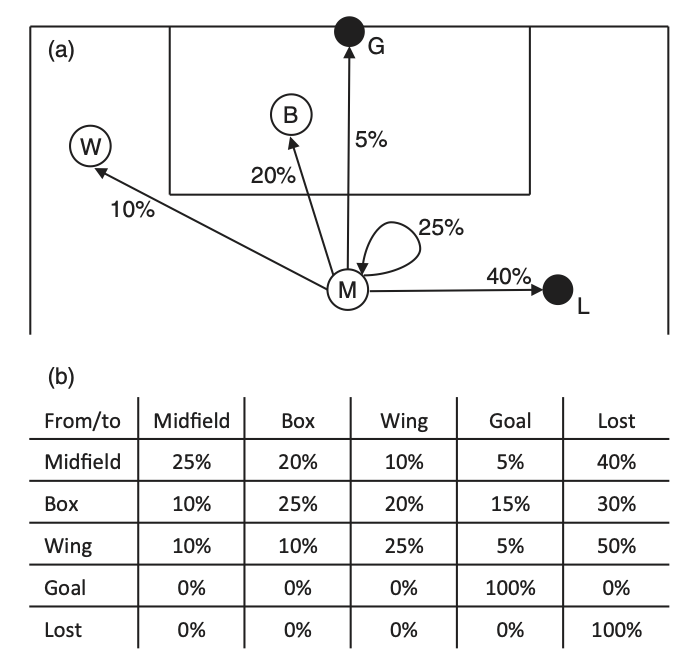
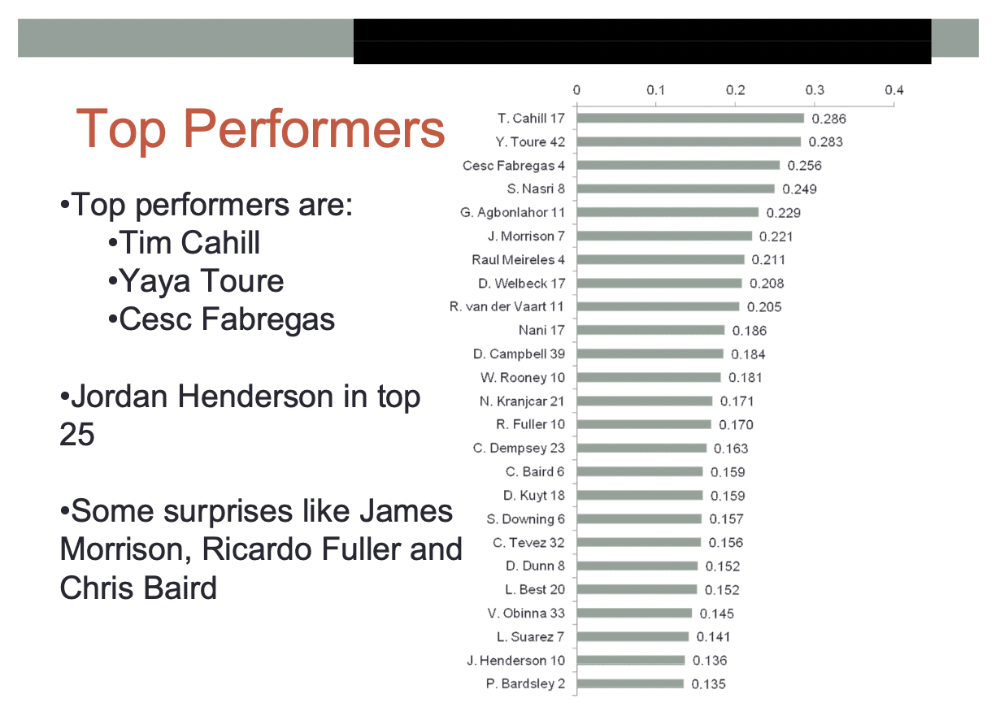

Evaluating actions
==================

### The effect of an action

Up to now we have looked at ways of giving context to actions and to compare them 
between players. In this section we look at methods – most of which involve some form 
of machine learning – to assign value to actions. The value we want to measure is the following:

> "How does an action increase or decrease the probability of a team scoring"

From this statement, it seems straightforward, right? And for shots we have already seen such a 
measure. Expected goals is the probability of a shot being scored. At the point the shot is taken we can 
use xG to measure the probability a goal is about to be scored. We know that it isn't perfect, but it is certainly
a good starting point.

For other actions, however, things are more difficult. A big part of the reason for this is that
we can't use on-the-ball data alone (i.e. the event data we have looked at up to now) to assess this probability.
A pass that puts a striker one on one against the goalkeeper is better than a pass into a well defended area. But
both of these can have the same start and end co-ordinates in event data. But even before we get to this 
problem (which we will in lesson 7), a more technical question, of *how we best estimate the effect of an action*, stands in our way. It is this 
question which will be the primary focus of this lesson.

To give an idea where we are going with this: below is an estimate of the probability of scoring given a team has the ball at 
a certain point on the pitch based on a model created by Jernej Flisar at Twelve football.

These show the probability of a goal being scored by that team 
before the ball goes out of play, given that a team has possession 
at a particular segment of the pitch in the Premier League 2019-20. Right in front of goal, this is 37.7%. 
At the centre circle it is 0.6%. Interestingly, it is higher in a teams own six-yard box (2.5%) than 
further out on the wings in a teams own half (0.0 to 0.4%), which is the least valuable place 
to have the ball.

### Different names for the same thing

In this course, I have decided to call all approaches to the above problem the same name: 
<dl>
  <dt><strong>Expected Threat (xT):</strong></dt>
  <dd> for attacking actions: passes, dribbles, carries etc.</dd>
  <dt><strong>Expected Defence (xD):</strong></dt>
  <dd> for defending actions: interceptions, blocks, </dd>
</dl>
This might be a somewhat controversial decision for those who have worked on these metrics. 
Indeed, the names used include [Goals Added](https://www.americansocceranalysis.com/what-are-goals-added),
[VAEP](https://dtai.cs.kuleuven.be/sports/vaep),
[On-Ball Value](https://statsbomb.com/articles/soccer/unpacking-ball-progression/), 
[Expected Possession Value](https://theanalyst.com/eu/2021/03/what-is-possession-value/),
and many more. Looking at all the different names, 
we might get the impression that they all do different things. But their aim is always the same. 
They are all different ways of solving the fundamental problem of (as I wrote above):

> "How does an action increase or decrease the probability of a team scoring"

So, my approach is to use the name *xT* to refer to any measure of the 
the affect of attacking actions and *xD* to refer to any measure of the 
the affect of defending actions. We then look at different approaches (some of which are included 
in the above named metrics) to measuring *xT* and *xD*.

The two major variations in implementation, which we will look at in more detail, are
<dl>
  <dt><strong>Position-based Expected Threat:</strong></dt>
  <dd> where we assign a value to every position on the field</dd>
  <dt><strong>Action-based Expected Threat:</strong></dt>
  <dd> where we assign a value to every action, based on its start and end position and 
various qualifiers describing that action</dd>
</dl>
Within these categories a variety of machine learning methods can be applied. Moreover, while in this section
we use event data to fit our model, it can be extended to include tracking and fitness data (in lesson 7).

### History: Sarah Rudd' Markov model

Expected Threat was invented by Sarah Rudd in 2011. She didn’t call it that. 
In fact, she didn’t call it anything, but she had the mathematical insight, 
using Markov chains, on which it is based. The text below is reproduced 
from [Soccermatics](https://www.amazon.co.uk/Soccermatics-Mathematical-Adventures-Pro-Bloomsbury/dp/1472924142/ref=sr_1_1?crid=1O6PV4A5TEQC2&keywords=soccermatics&qid=1662537339&sprefix=soccermatics%2Caps%2C146&sr=8-1) (the book).

Rudd’s research paper and presentation has become something of a 
legend in the football analytics community. It was the very early days of 
football analytics, and most club analysts hadn’t yet got as far as sorting their 
player spreadsheets, let alone talking about expected goals. So when Rudd took the 
stage at the New England Symposium on Statistics in Sports at Harvard to present her 
[‘framework for tactical analysis and individual offensive 
production assessment in soccer using Markov chains’](https://docplayer.net/27070167-A-framework-for-tactical-analysis-and-individual-offensive-production-assessment-in-soccer-using-markov-chains.html)
, she was moving into completely new territory.

The model divided the game in to a set of ‘states’, 
where each state describes where the attacking team has the ball and the 
arrangement of the defending team. A simplified example below
divides the pitch into states for Box, Wing, Midfield, Goal and Lost. The first three of 
these states describe where the attacking team has the ball. The ‘Goal’ state means that a 
goal has been scored, and ‘Lost’ means that the attacking team has lost the ball. 
The arrows leading out of the ‘Midfield’ state show the probability of reaching each of the other 
states: there is a 20% probability of getting the ball in to the ‘Box’, a 12% chance 
the ball is moved out to the ‘Wing’, and so on. 

These probabilities are also shown in the game transition table below; 
each entry in this table is the probability of the game moving from one state to another.

It is here that the mathematical idea of ‘Markov chains’ comes in. 
A Markov chain model assumes that the change between match states does 
not depend on what has happened earlier, only on the current state. So if the 
attacking team has the ball in midfield, the probability of it going into the box is the same, 
irrespective of whether the team has carried out a long sequence of passes, or if the ball 
has just ricocheted off a defender in the box. 
This assumption doesn’t always hold in football, but it is a reasonable starting point.

Using the Markov chain assumption I can calculate the value of different match states. 
To do this I find the probability that the ball will eventually end up in the goal or be lost
to the opposition. For the example in the figure below, I find that a ball into the box will 
eventually result in a goal in 25% of cases and the ball being lost in 75%. 
A ball in midfield ends up in the goal in 15% of attacks and will be lost during 85% of attacks, 
while a ball on the wing results in a goal in 12% attacks and is lost on 88% occasions. 
These probabilities – Box 25%, Midfield 15% and Wing 12% – are thus the value of having 
the ball in each game state.

In the figure above, there are three states for possession: 
M is having the ball in Midfield; W is having the ball on the Wing; and B is having the ball in the Box. 
Two additional states, G for Goal and L for Lost indicate the end of a possession. In (a) states 
are represented as circles. Each of the percentage values 
indicates the probability that the next action is observed from when the ball is in midfield. 
(b) Probabilities of moving between states. Rows are the current state, 
columns are the next state, and the entries themselves are the probability of 
moving from one state to the next.The Goal and Lost states are special since 
they mark the end of the possession. These values are not measured from data, but are
used to illustrate the approach.

Sarah Rudd realised that these probabilities can be used to assign credit to 
players for an attacking move. For example, consider a central midfielder, 
a winger and a striker all involved in a goal. The winger cuts the ball back to midfield, 
the midfielder plays a through ball to the striker and the striker places it past the goalkeeper. 
How should we divide credit for the goal between these three players?

Usually, we give all of the credit to the striker for the goal, and the 
midfielder for the assist. But this is hardly fair on the winger who set up the move. 
The answer is to count how much each player improved the goal-scoring probability. 
When the winger passed to midfield, the probability of a goal increased from 12% to 15%, 
so the winger receives 15–12=3 points. When the midfielder made the through ball, 
the probability of scoring was increased, so the midfielder receives 25–15=10 points, 
and when the striker scores they receive 100–25=75 points for completing the move.

This measurement may still appear biased toward the striker, but if we count all successful 
passes by the winger, not just those that result in a goal, then they begin to accumulate 
quite a few points. Imagine, for example, that the winger completes 10 passes back to midfield 
and 5 passes into the box during the match. This gives the winger 10 × 3 + 5 × 13 = 95 points 
for that match.

Rudd’s method also allows us to see the difference between players who simply pass 
a lot and those that create chances. For example, imagine that the attack starts 
with the midfielder who passes the ball out to the wing, before a winger makes
a successful cross in to the box. Now the midfielder receives negative points, 12–15=-3 points, 
because a pass to the wing typically reduces the probability of a goal. 
The winger receives 25–12=13 points for the pass in to the box. The method punishes players 
who make it harder for their own team to score goals by assigning them negative points.

Rudd made several striking predictions in her ranking. One of these was ranking Jordan Henderson 
(then playing for Sunderland, and soon signed by Liverpool) as a top-25 Premier League player in the 
2010-11 season.

Darren Bent, on the other hand, didn't fare well in the rankings. 

Bent was sold to Aston Villa for 24 million, Henderson went to Liverpool for less than 20 million. Rudd 
was recruited to Arsenal and now runs a leading sports analytics company.

