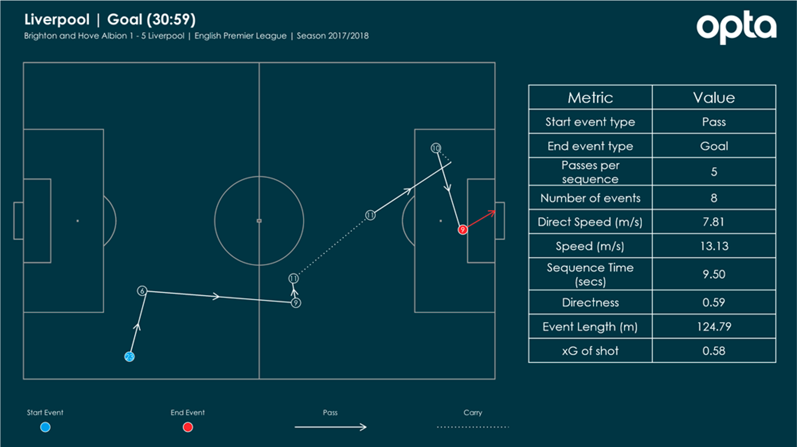
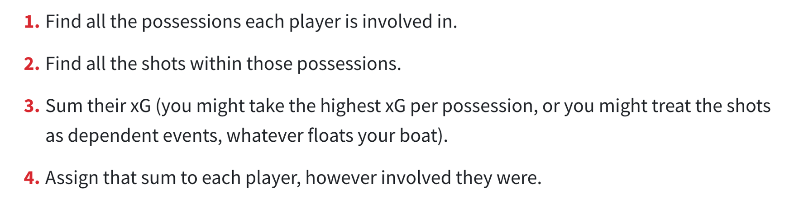
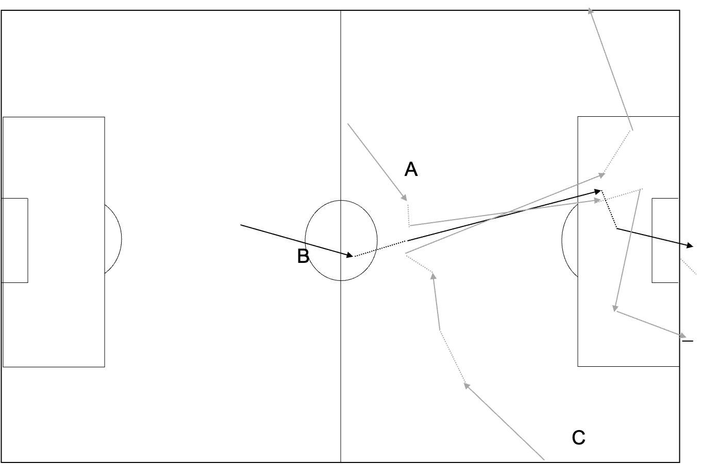
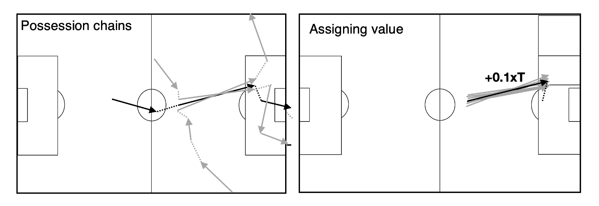
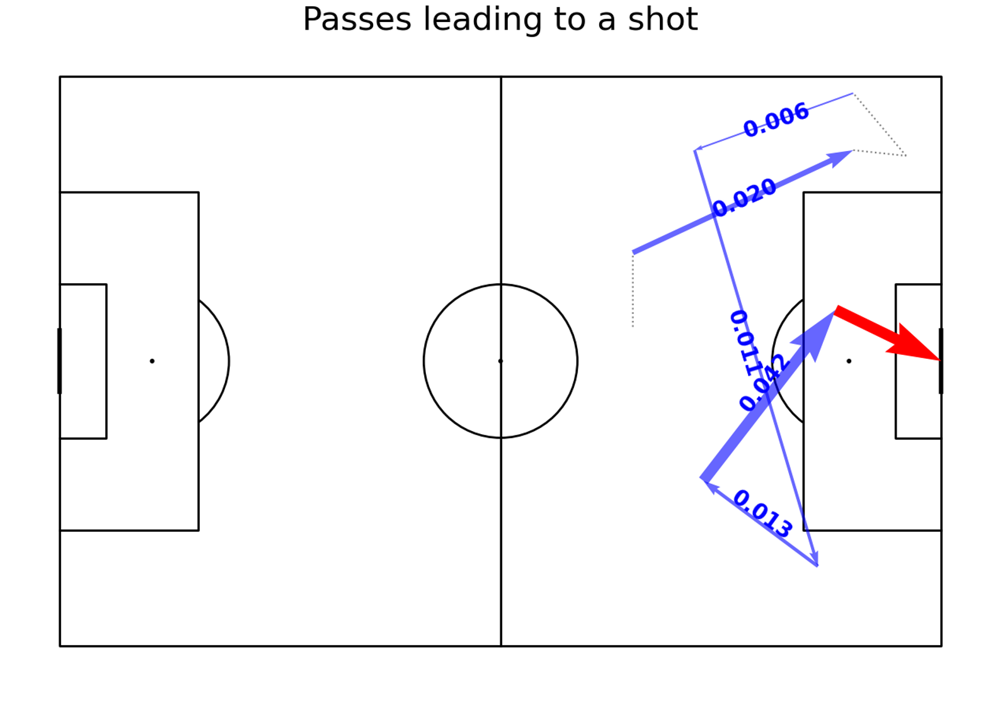

Expected Threat - Action-based
==============================

We now move away from a position-based approach and take an approach based on chains of possession. 
To do this, we first need to look at the idea of a possession chain: a sequence of events 
where the same team has unbroken control of the ball. We then use this possession chain as the 
building block for an expected threat based on actions within that chain.

<iframe width="640" height="360" src="https://www.youtube.com/embed/pSr8bs7-QZw" title="YouTube video player" frameborder="0" allow="accelerometer; autoplay; clipboard-write; encrypted-media; gyroscope; picture-in-picture" allowfullscreen></iframe>

The logic of focussing on actions in a chain instead of position comes from the fact that
football is a dynamic game: the threat then lies in how the ball is moved, 
rather than where the ball is. A pass does not just have value because of where the ball ends up, 
it also has value on how it shifts the defence. Cross-field balls, which don't move the ball 
forward, should still give positive value. A method which evaluates passses 
should also assign positive value to back passes, since they can be a step 
toward moving the ball forward later on. By looking at the actions within a chain, we can start 
to look at this context. We can also include qualifiers, 
such as whether it was a cross or a through ball. This prevents, for example, us 
overvaluing ‘hopeful’ crosses in to the box. 

Thats the overall philosophy. We now look at how to build this approach.

### Possession chains

The basic idea of a possession chain is to group together actions where a team has an unbroken
sequence of possession. The example from Opta shows the build-up to a Liverpool goal.

Several statistics, including rate of passing within the chain and directness of attack can be calculated.
These often tell us something about the difference in style of play of the teams.

The idea of xGChain is to simply credit every player in the chain with the end xG of that particular chain.This is
how the approach was [described by Statsbomb](https://statsbomb.com/2018/08/introducing-xgchain-and-xgbuildup/).

They used it in this example to show how Messi contributes most to goals in La Liga.

The possesion chains opens up for a whole range of opportunites for classifying the value of possessions,
below we look again at two visualiations that we already saw in [lesson 1](../lesson1/VisualisingFootball.md).
The first is the quality of chances Liverpool had when they entered the final third, 
broken down based on entry point. 

This uses a chain to link, where the ball went in to the final third back to the xG (shown 
as a heat map) of the resulting chances. The second is transistions. The area of 
the circle is the xG of chance ( a star indicates a goal), while the position of the circle is the 
starting point of the possession chain.

There are a range of different ways to define a possession. 
In the [next lesson](../gallery/lesson4/plot_PossesionChain) we calculate it on the basis that
posssesion of the ball changes between teams when they have two consecutive touches.

### Evaluating actions in a chain

We can now evaluate actions within a chain. We maintain something of the idea of the memoryless 
nature of football, but now we include both the start and end co-ordinates of the pass. It is worth 
stressing that there are lots of different ways of approaching this problem: both in terms of how much 
of the chain we use in our model and the type of machine learning method we use. But the basic idea is as 
follows. We have a large number of possession chains, as illustrated below for just three,

In this example, all three chains have a similar pass. We might find, as in the example, below that one 
in ten of the chains containing a pass like this lead to a goal.

We then say that a pass like the one above above is worth +0.1xT because 10% of the 
times that pass similar to it leads to a goal. 

To assign values like this using a machine learning model,
we first make a table of all the possession chains, with the value of the xG assigned to all 
events in the chain.

We then fit a model which predicts the expected goal value (output variable) of the chain as a 
function of the start $(x_1,y_1)$ and end $(x_2,y_2)$ co-ordinates of the pass (input variables). 
One way to see this is as fitting a function

$$ P(\mbox{shot} |  x_1,y_1, x_2,y_2) = f_1(x_1,y_1, x_2,y_2) $$ 

to the data in the table. We can do this using logistic regression with $f_1$ as a polynomial 
combination of $x_1 ,y_1, x_2$ and $y_2$. Or, as we do in [the Python code](../gallery/lesson4/plot_ActionBasedExpectedThreat),
we can use a method such as xGBoost.

Once we have fit the probability of shooting, we can go on to fit the probability of a goal to all xG chains 
ending in a goal.

$$ P(\mbox{goal} | \mbox{shot}, x_1,y_1, x_2,y_2) = f_1(x_1,y_1, x_2,y_2) $$ 

where the output variable is now the xG of the chance. In the code we show how 
a model like this assigns a different value to each pass in the chain

The key advantage of these values, over position-based values seen earlier, is that they
reveal the 'threat' gained by passing the ball across the pitch or even backwards. 

### Other approaches

As I wrote in the introduction there are many different ways of implementing this basic 
method of evaluating actions. In the video below, Lotte Bransen gives an introduction to a 
series of lectures, made together with Jan Van Haaren, on valuing actions in football using 
statistical models and machine learning.

<iframe width="560" height="314" src="https://www.youtube.com/embed/xyyZLs_N1F0" title="YouTube video player" frameborder="0" allow="accelerometer; autoplay; clipboard-write; encrypted-media; gyroscope; picture-in-picture" allowfullscreen></iframe>

She outlines
<ol>
    <li>Why go beyond traditional statistics to assess football players?</li>
    <li>How to assess the performances of football players?</li>
    <li>What does the VAEP framework have to offer?</li>
</ol>
All the code for this tutorial series is available [here](https://github.com/soccer-analytics-research).

