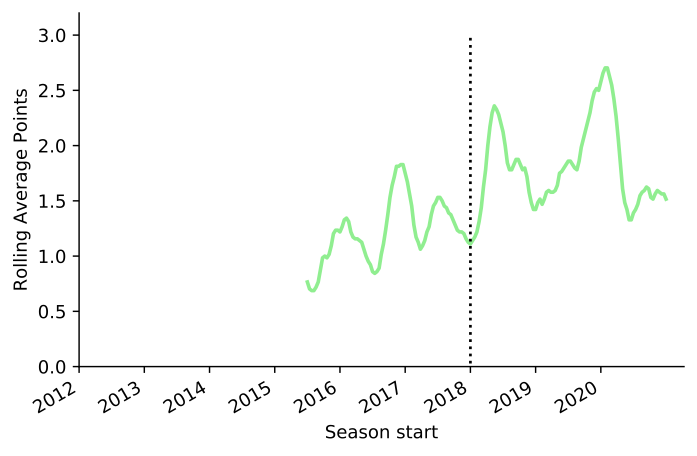
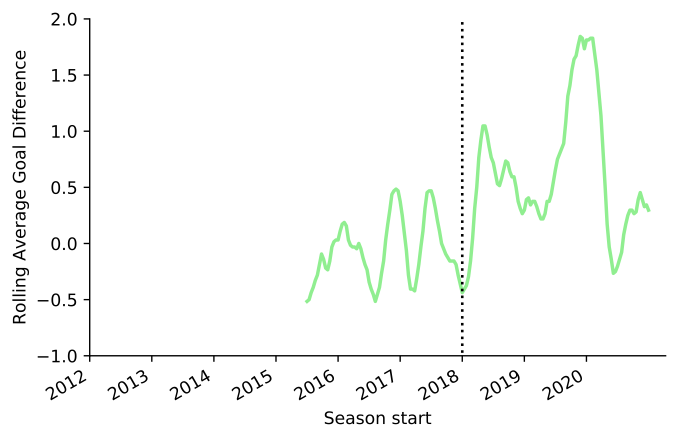
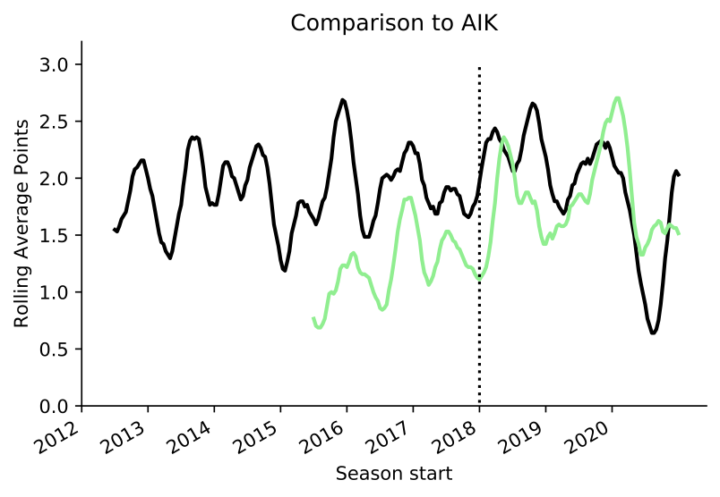
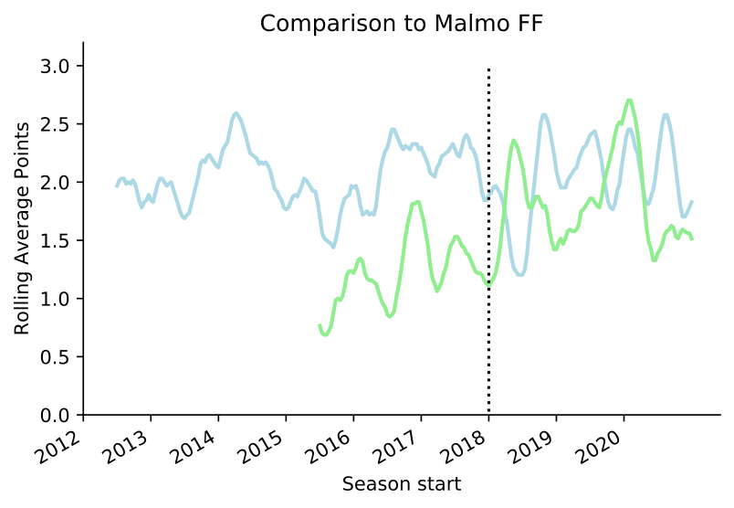

Case study: Long term trend at Hammarby
=======================================

When working with a football club, it is important that KPIs reflect that work over different time scales. For the
board of a club they want to see longer terms: is the club going in the right direction. This is part of a report I
wrote for the board at start of 2021. 

The plot below shows a rolling average of points for Hammarby before and after Stefan Billborn took over as manager.
The rolling average ‘smooths’ over 15 matches to show the underlying trend.

 

There is a clear and sustained improvement in points per game. Even the team's bottom level 
(i.e. start of 2021 season and end of 2018 season) are better than now than in 2017. The same is true if we 
look at goal difference.

 

### Comparing to top-three teams

Hammarby's ambition is to be a regular top-three team. 
In having that ambition, we have to be aware about the typical ups and 
downs of teams who have been in that position previously. 
Here I compare points per game rolling average to AIK.

Our current points rolling average is similar to a level of AIK throughout the last decade. 
The peaks and troughs Hammarby now experience now are quite similar to those experienced 
by AIK over the last 10 years. From 2011-2020 they won 
Allsvenskan once, second four times and only failed to finish top-four once (in 2020). 
Which is by any definition a ‘regular top 3 team’. 

It is important to remember that doing well consistently in Allsvenskan is difficult, 
because it is very competitive between quite a few teams. So even regular top-three teams 
should experience fluctuations of this type.

### Comparing to best team

Malmö have had a consistenly high level for a decade.

If, when we say we want to be a top-three team, then we mean we want to be like Malmö, 
t hen we have a significant amount of work to do and investment to make. They perform at a high level with 
smaller fluctuations.

### Conclusion

The main point of this image is to allow us to Zoom out and see the longer term perspective. 

