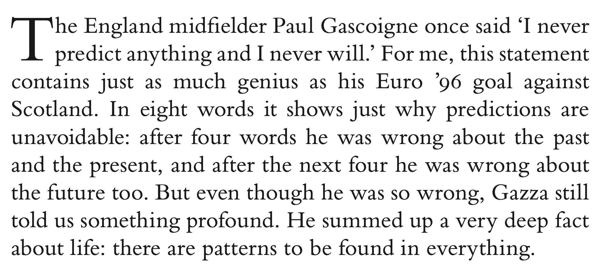
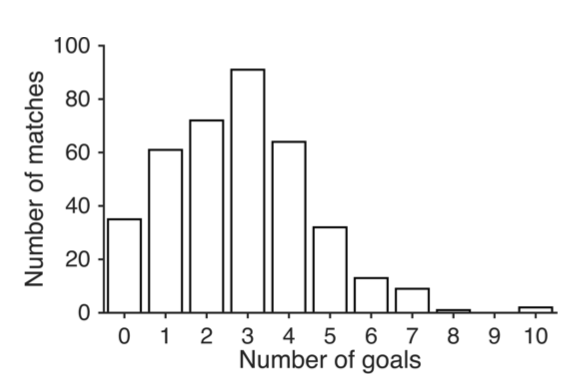
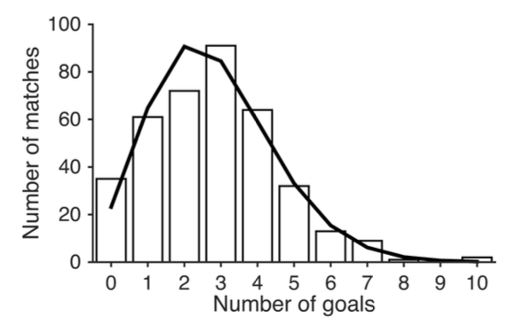
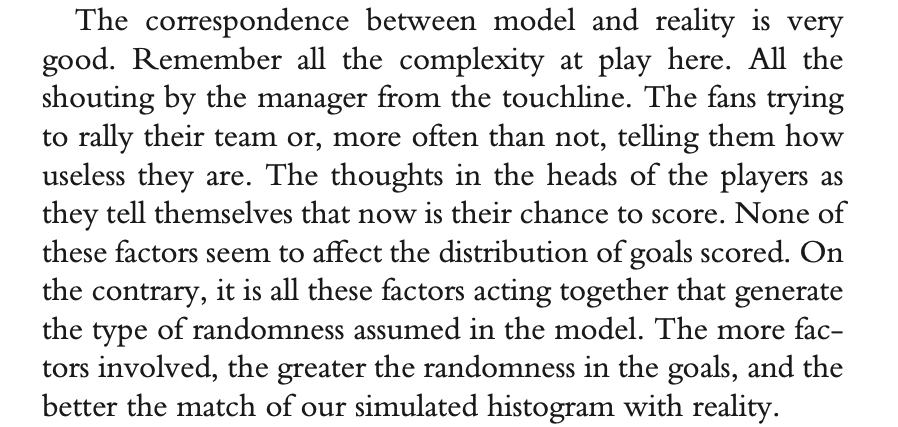
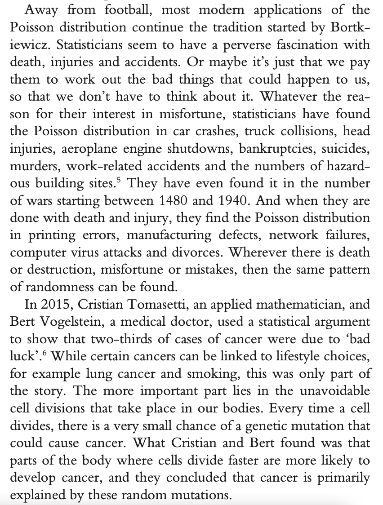

Unavoidable randomness
======================

We start our journey in to randomness with a quote from Paul Gascoigne...

 

### Probability of scoring

What makes football and other team sports exciting is their unpredictability. 
If you are watching a match and look away for a few seconds, you can miss an 
important build-up and a sudden goal. As a modeller, this tells me something important.
A goal is just as likely to occur at any time during the match. While there are all sorts of 
factors determining the rate at which teams score, the timing of goals is more or less random.

With an average of $2.79$ goals per match, the probability that there is a 
goal in any one minute is $2.79/90 = 0.031$ (we ignore added-time in this model). 
This means that the chance of us seeing a goal in any randomly chosen minute is 
about $1$ in $32$ (i.e. $1/32 \approx 0.031$). 

### Histogram of goals over a season

You can get a feeling for the unpredictability that Gascoigne was 
talking about by looking at the results over a season. Let's take the 2012/13 Premier League season. 
There were some pretty exciting matches and unexpected outcomes. 
Liverpool won 5–0 twice and 6–0 another time, but still failed to qualify for Europe. 
The season ended with the retirement of Alex Ferguson, the king of unexpected last-minute changes in fortune. 
His last match as Manchester United manager was no exception: a 5–5 draw in which West Bromwich Albion 
scored three goals in the last ten minutes. ‘Football, bloody hell!’, as Fergie once put it.

These results are the exciting exceptions, the season’s most memorable matches. 
There were also a fair number of boring 0–0 draws, forgotten by the fans, 
perhaps, but not by the season’s statistics. If we want to understand the underlying pattern, 
we need to include these in our analysis, too. The figure below is a histogram of the 
number of goals scored in all Premier League games in the 2012/13 season. The average number of 
goals scored was 2.79 as we assumed in our model in the previous section.

 

The histogram shows how often various scorelines occurred. In all there were 35 0–0 draws, 
which is the first bar on the histogram. Ferguson’s last match was one of two that season which 
ended with 10 goals being scored, as can be seen over on the right. In the middle, the most common 
goal tally was three, and in the majority of those games the final score was 2–1. A pattern is 
already starting to appear. A pattern very similar to the one we saw in our simulation on the 
previous page.

The plot below compares the average season simulation (solid line) to the 
distribution of goals (histogram) in the Premier League 2012-13. 

In Soccermatics, I write the following:

 

I assumed in my simulation that neither the number of goals scored so far, 
nor the amount of time played, influences the probability of another goal being scored. 
The resulting distribution succeeds remarkably well in capturing the overall shape of the 
goal histogram.

The model predictions are, however, not perfect. The first reason is that we always 
expect variation between seasons. If you run a season simulation a few times, sometimes there were more matches with 
3 goals than 2, other times it was the other way round. Similarly, sometimes there were no 
matches with 8 or 9 goals, other times there were. Such *model variation* is to be expected from any model. 

The second way in which the model varies from reality is for 10 goal matches. 
These are extremely unlikely in the model, but occurred a couple of times during the 2012-13 PL season. 
There also appears to be more 0-0 draws than the model predicts. These are due to *model error*. 
Our model is based on a very simple assumption: that goals are equally likely to occur at any
time point in the match. But this result would suggest that the assumption is wrong in two 
specific situations

1. Teams drawing 0-0 appear to settle for a draw.
2. Sometimes matches, like Fergies last match, go a bit crazy and more goals than expected are scored.

Notice that the model can give even more insight when it is wrong! 
If we were creating a model of football betting then these discrepencies 
are important and we would want to change our model assumptions. But for many 
applications, it is enough to be aware of them.

### The Binomial Distributions

Before we look at the Poisson distribution (which we will find is a good way of describing the 
occurance of goals), lets look at a few probability calculations.

Let's call the probability per minute of scoring $p$ and the number of minutes in a match $n$. 
For our football simulation, $p=2.7/95=0.028$ and $n=95$ minutes. Let's now imagine we miss the first 
5 minutes of a match. What is the probability there is no goal in that time? Well, 
the probability there is no goal in the first minute is $1-p$, e.g. $1-0.028=0.972$ for football. 
The probability there is no goals in the first two minutes is then, following the logic above,

$$(1-p) \cdot(1-p) = (1-p)^2 $$

And, following the same rule, the probability that there is no goal after 5 minutes is 

$$(1-p) \cdot (1-p)\cdot(1-p) \cdot (1-p) \cdot(1-p) = (1-p)^5$$

In the case of football, this is $0.972^5 \approx 0.868$. The probability that you haven't 
missed any goals if you switch on the TV five minutes after a match has begun is 86.8%. 

In order to find the probability there are no goals in the whole match, we just have to keep on multiplying... 
95 times for the 95 minutes. That is, 

$$\underbrace{(1-p) \cdot (1-p)\cdot ... \cdot (1-p) \cdot(1-p)}_{95   \text{ times}} = (1-p)^{95}$$

which is $0.972^{95} \approx 0.067$. There is 6.7% probability that there is no goal for 
either team during the match.

What is the probability of exactly one goal in the first 5 minutes? Using the notation 'o' for no goal 
during a minute of play and 'X' for a goal then there are 5 different ways in which a single goal can occur:

1. Xoooo (goal in first minute)
2. oXooo (goal in second minute)
3. ooXoo (goal in third minute)
4. oooXo (goal in fourth minute)
5. ooooX (goal in fifth minute)

We can thus write the probability of a single goal occuring in the first minute as

$$ p \cdot (1-p) \cdot (1-p) \cdot (1-p) \cdot (1-p) + \\ 
(1-p) \cdot p \cdot (1-p) \cdot (1-p) \cdot (1-p) + \\ 
(1-p) \cdot (1-p) \cdot p  \cdot (1-p) \cdot (1-p) +\\ 
(1-p) \cdot (1-p) \cdot  (1-p) \cdot p   \cdot (1-p) +\\ 
(1-p) \cdot (1-p) \cdot  (1-p) \cdot (1-p) \cdot p  
$$
Since the order by which me multiply isn't important, the expression above can be simplified to,

$$ 5 \cdot p \cdot (1-p)^4 $$

In general, for $n$ minutes and probability $p$ of a goal per minute, the probability of exactly one goal is

$$ n \cdot p \cdot (1-p)^{n-1} $$

Applying this to the Premier League example,

$$95 \cdot 0.028 \cdot (1-0.028)^{94} \approx 0.184$$

$18.4$ percent of matches end with only one goal.

The next question is how many ways we can have $k$ goals during $95$ minutes? 
To get a handle of this, first imagine first 
that you were given a folder with a 95 minute match split up in to 1 minute segments. 
How many different ways would 
there be to order these files in the folder? In the video I explain that there are 

$$ 95 \cdot 94 \cdot 93 \cdot 92 \cdot \cdot \cdot 3 \cdot 2 \cdot 1 $$

ways to arrange these files. Now imagine that $k=4$ goals have occurred in the match in four different minutes 
of the match. How many ways could these $4$ goals be arranged within the folder? This is

$$ 4 \cdot 3 \cdot 2 \cdot 1 $$

For a general value of $k$ this is 

$$ k \cdot (k-1) \cdot \cdot \cdot 2 \cdot 1 $$

And finally, what about the $86$ the minutes that wern't goals. How many ways are there to organise these? Well, this is

$$ (95-k) \cdot (95-k-1) \cdot (95-k-2) \cdot (95-k-3) \cdot \cdot \cdot 3 \cdot 2 \cdot 1 $$

In order to find all the ways in which 4 goals can occur in a 95 minute match we divide the ways to arrange
all of the minutes by the ways to arrange the goals times the way to arrange the non-goals. That is,

$$ \frac{95 \cdot 89 \cdot 88 \cdot 87 \cdot \cdot \cdot 3 \cdot 2 \cdot 1}{4 \cdot 3 \cdot 2 \cdot 1 \cdot 91 \cdot 90 \cdot 89 \cdot 88 \cdot \cdot \cdot 3 \cdot 2 \cdot 1} $$

The short hand for writing this (for the case of $k$ goals) is:

$$ \frac{95!}{(95-k)! k!} $$

where $!$ is know as a factorial. This can be used to find the probability of $k$ goals in a 90 minute match of

$$ \frac{95!}{(95-k)! k!} \cdot (2.7/95)^k \cdot (1-2.7/95)^{95-k} $$

This is the binomial distribution. And gives the probability that there are $k$ goals assuming that only one goal
can happen per minute and that goals occur at random times during the match.

### The Poisson Distributions

Dividing the match in to 90 minute blocks is somewhat arbitrary. Imagine instead that we broke it down in to $n$ 
discrete time slots, withing each of which a goal can occur. Now the probability of $k$ goals in these $n$ slots
is 

$$ \frac{n!}{(n-k)! k!} \cdot (2.7/n)^k \cdot (1-2.7/n)^{n-k} $$

The Poisson distribution is obtained by first rearranging this equation to get

$$ \frac{n \cdot (n-1)  \cdot  \cdot \cdot (k+1)}{k!} \cdot (2.7/n)^k \cdot (1-2.7/n)^{n-k}$$

then 

$$ \frac{\frac{n}{n} \cdot \frac{n-1}{n}  \cdot  \cdot \cdot \frac{k+1}{n}}{k!} \cdot (2.7)^k \cdot (1-2.7/n)^{n-k}$$

which is

$$ \frac{(1-\frac{1}{n}) \cdot (1-\frac{2}{n}) \cdot \cdot (1-\frac{k-1}{n})}{k!} \cdot (2.7)^k \cdot (1-2.7/n)^{n} \cdot (1-2.7/n)^{-k}$$

When we take the limit $n \rightarrow \infty$ we get

$$ \frac{1}{k!} \cdot (2.7)^k \cdot \exp(-2.7) \cdot 1$$

which is gives a probability of $k$ goals in a match of

$$ \frac{(2.7)^k \exp(-2.7)}{k!} $$

This is the line which I compared against the goal distribution for the Premier League.

This single equation, which has only one parameter (the mean number of goals per match of 2.7)  captures the **whole 
distribution curve** for goals per match. This is a very powerful observation, because it not only allows us to
assign probabilities to match outcomes, but it also allows us to (through Poisson regression) to evaluate both teams
and how various actions contribute to effective football.

## Other examples of Poisson distribution

The Poisson distribution has many applications...

The cancer study mentioned above caused some controversy. If cancer is just random, 
then why should we spend so much money researching its causes? To justify using the term ‘bad luck’ 
and in order to better explain their conclusions, Cristian and Bert used an analogy with car accidents. 
The more time you spend in the car driving around, they said, the more likely you are to be in an accident. 
How you drive the car is a factor, but your time at the wheel is important too.

A footballing analogy works just as well, if not a little bit better. You can think of every cell division in 
your body as akin to a single minute of a football match. When a cell divides, there is a (very) tiny chance of a 
random cancerous mutation, just as there is a (much bigger) chance of conceding a goal in a football match. 
It is in this sense that cancer can be thought of as bad luck. Sometimes our team gets through a match without 
conceding a goal, and hopefully we get through our life without getting cancer. And while 
sometimes we lose because the opposition were good, no one can deny that luck plays an important part in any 
particular match. Our health is like a Saturday afternoon watching from the terraces, 
and not all goals are preventable.
