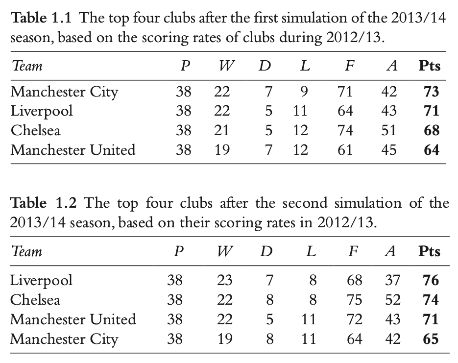

Predicting football matches
===========================

In this video (edited from a live version of an earlier version of the course) I look more closely at how the Poisson distribution can be used in football to both predict results and model team performance.

<iframe width="640" height="360" src="https://www.youtube.com/embed/otMo6tN3Vjo" title="YouTube video player" frameborder="0" allow="accelerometer; autoplay; clipboard-write; encrypted-media; gyroscope; picture-in-picture" allowfullscreen></iframe>

### Luck and randomness 

Resimulating the league using the Poisson assumption shows that the results can easily be very different just because of the random nature of the way the goals go in.

 

As interesting as each of these two alternative realities may be, individually they are unimportant. What is important is to summarise what happens over 10,000 simulations. How often did different teams win the league? When we do this, we see that Liverpool won in only 11.5% of the simulation runs. Manchester United, who had won the title the season before, won 26.2% of the runs. Chelsea won 19.2%, Arsenal 17.6%, Manchester City 12.8% and Tottenham Hotspur 6.0%. 

In reality, of course, United failed to win in the simulated season (after a change of manager). And now have a smaller chance of victory. But what these results show is just how much of the result over the league is determined by randomness.

This picture is reaffirmed by a look at (in to 2019-20 season) which teams were statistically better than Arsenal. The brown/red marked teams, would at a 5% significance level, be judged better than article on their scoring rates. The green marker teams, are signifcantly worse. This leaves 

 

Poisson-based models are not perfect. They tend to underestimate best teams, and overestimate worst teams. During the season we might want to use an xG-based model rather than a goal-based model to predict the outcome for the season as a whole. 

### Limits of prediction

<iframe width="640" height="360" src="https://www.youtube.com/embed/dUOCPQOkeXY" title="YouTube video player" frameborder="0" allow="accelerometer; autoplay; clipboard-write; encrypted-media; gyroscope; picture-in-picture" allowfullscreen></iframe>
