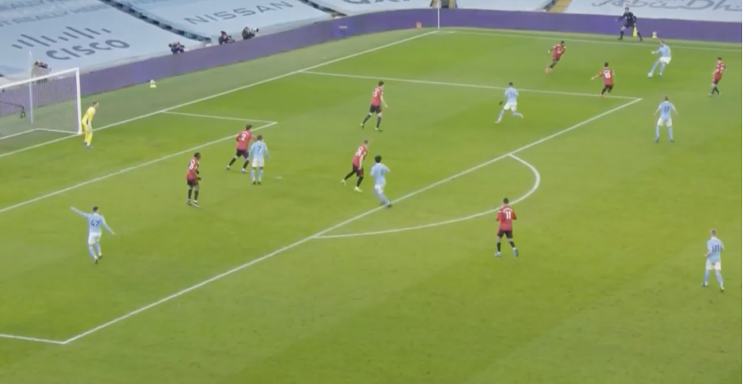
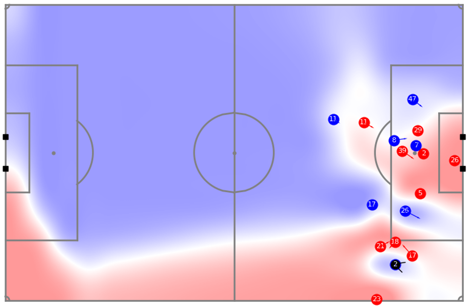
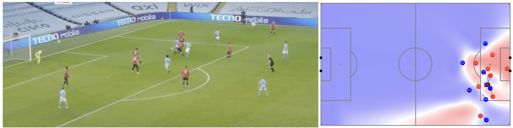
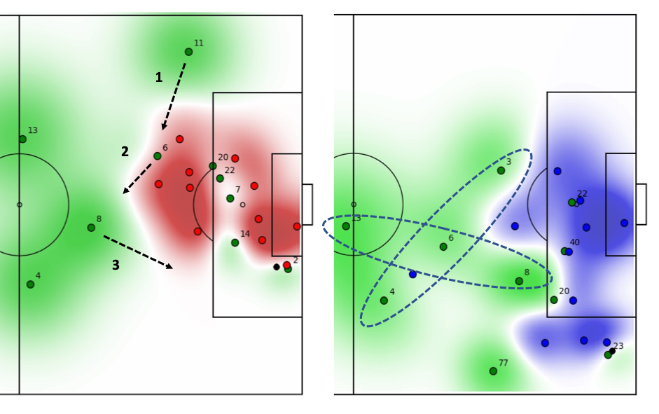

Case study: defence in attack
=============================

In [lesson 4](../lesson1/BallRecoveries.md) we looked the ‘five-second-rule’: 
measuring how often a team wins back a lost ball within 5 seconds. It is one thing to have a KPI 
like this measures success on the pitch, it is quite another to find novel ways of producing that success. 
It is here that patterns come in to analytics: how do we organize the team to improve performance?

Often when we hear about the ‘5-second rule’, we are told that the key is for players to immediately 
press the opposition when they lose the ball. This is certainly important; we need commitment by all 
players in order to succeed. But commitment is not, in itself, enough. We also need organization. 
We need the correct spatial pattern. 

The image below shows a situation in the 77th minute of Manchester City’s visit to Manchester 
United in the 2020/21 season. 

City are attacking with four players in the box. What I want to draw your attention to here is 
the positions of three players: Kevin De Bruyne (17) who is just outside the box, 
Ilkay Gündogan (8) who is on his way in to the box and Oleksandr Zinchenko (11) who is on the 
bottom right of the picture.  

We can also view this through pitch control, which shows which shows which player 
would get to the ball first if it were at that point on the pitch.

Zinchenko positioning is interesting because his ‘official’ position in the line-up is left-back. Yet he is standing centrally, controlling the midfield area. It is this which allows De Bruyne to take a position where he can receive a short pass and, most importantly, it allows Gündogan the freedom to run in to the box.

In this particular example, the pass from the left was unsuccessful and the ball went out for a throw-in. But after the throw-in, a new very similar situation was created. Here is the position of the players when the ball was played in to the box. 

Zinchenko is now even more central and when the ball was cleared, it lands at his feet. 
City complete an under-five-second regain, partly because De Bruyne and Mahrez are pressing 
(with Gündogan on his way), but also because Zinchenko is well positioned to regain a loose ball 
resulting from the press.

By setting up in this way – with the fullbacks playing in a midfield role whenever 
their teammates have the ball in the final third – Manchester City can both prevent counter-attacks 
and quickly regain possession. As a result, they can get more players in to the box when attacking.

City lost this particular match, but they won the league and conceded very few goals. In terms of 
regaining the ball in the final third, in the area in front of the goal, they were best in the Premier League 
2019-20. Part way through 2020-21, they have regained the ball in front of goal within 5 seconds after 25% of losses. 
For comparison, Manchester United have regained the ball within 5 seconds for only 15% of losses. 
In the long term, having a clear structure to play, allows the team to improve the things which are 
important to success.

In the examples above, we only track the positions of the players 
broadcast on the TV screen, but using 22-player tracking data 
(which is available for most teams for their own league) we can see the positions of all players. 
Using this data, we can show players how they are controlling space, even when they are a long way from the ball. Pitch control becomes a powerful way of illustrating how each player’s off-ball positioning affects their teammates decisions. 

Below are two examples of player positioning, which I have used to help players improve their positioning. 

In the example on the left, the left-back in the green team 
(player 11) has taken a position wide on his wing, while the ball is in the box on the right (player 2). 
The arrows show how he can correct his position by moving centrally and, in doing so, allow one of the 
central midfielders (player 8) to get nearer to the edge of the box. In the example on the right, the 
team have a much better positioning. The left-back in this case (player 3) has come centrally, allowing 
the team to control the area outside the box: 6 moves centrally, 8 moves towards the edge of the box. 
Manchester City take this idea one step further, with the left-back coming all the way in to the space 
otherwise occupied by the 6.

The dashed ellipse in the right-hand figure form a cross-like shape, providing a template for the 
players to follow. While five players attempt to complete a successful pass in to the box, the other 
five cover as much space centrally as they can. A key point here is that – like the geese formations 
which we looked at the first article and which we also know Pep Guardiola is so impressed with – a player’s 
task is to find the empty point in the defensive shape (in this case a point in the cross) and occupy it. 
No central planning is required, just an understanding which positions need to be filled.  

The dynamic cross ‘formation’ discussed above is very different from the team’s playing formation or 
line-up (such as 4-3-3 or 4-4-2). A modern coach’s job is, based on the KPIs set up for the team, 
to provide these types of dynamic formations for a wide-variety of situations: ranging from how the 
team should play out from the back, to the way the team should press in each third of the field. 
Ideally, the description of each situation should be accompanied by straightforward ‘rules of thumb’ 
for the players. In following these rules, playing position is less important than ensuring that a 
certain shape is preserved. 

Analytics can be helpful, not just in setting the original KPIs, but also in visualizing how well 
the players are following the rules which we think will lead to better performance. In the above 
examples, we use the pitch control images to provide feedback directly to the players. 
In my own work, I have found that players respond well to this kind of visual feedback: 
they immediately see strengths and weaknesses in their own positioning (and that of their teammates!).

The role of the coach is to translate tactics in to well-defined dynamic formations. 
The role of the data scientist is to support the coach with tools which automatically 
identify these situations and allow for effective feedback to the players. Together they can 
create the patterns of play that win matches. 
