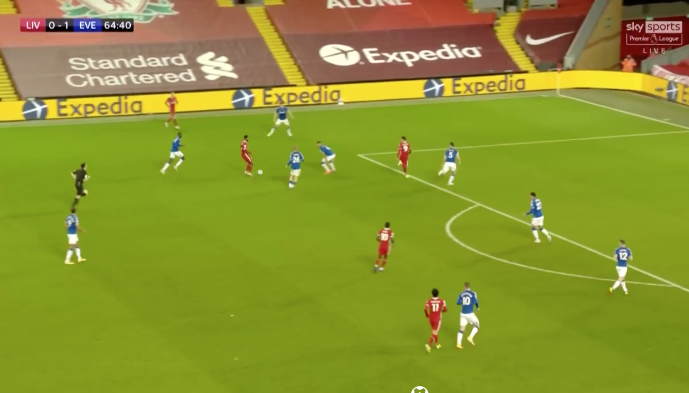

Off-ball movement radars
========================

### Attacking movements

A player who exemplifies the need for off-the-ball data when evaluating players is 
Roberto Firmino. He is often referred to as ‘underrated’ by commentators, because 
although he doesn’t score as many goals as Mohammad Salah, it is his off-the ball movement 
which often creates space for his teammates. 

To get an idea how we might measure Firmino’s skill we need to start with an example. 
One of his runs against Everton is shown below. Firmino is running out to the edge of the box, 
dragging a defender with him.

There is nothing exceptional about this particular run. 
It is just a nice example of something Firmino does non-stop. 
He is always looking for and finding ways to open up space around the box. 
Sometimes he gets the ball, sometimes he doesn’t, but either way the movement is there 
and the defence is disrupted.

At Twelve football we combined event data and tracking data to measure this movement. 
We created freeze-frame data of every action where event data is supplemented with tracking 
data from Skillcorner showing the position and direction of all players near to that action 
(i.e. in the frame of the TV broadcast footage). Once the freeze frame data of a pass is created, 
the key to evaluating a player is looking at the pass alternatives available at that point. 
To determine this, we first calculate the pitch control 
(probability of receiving a pass) as illustrated below.

We then multiply it point for point with expected threat 
(probability of scoring given a pass succeeds) which we saw in lesson 4.

This essentially gives the probability a team will score if the pass is made. This is shown below

Notice that this again gives a natural way in which to measure actions. It is the probability that a goal
will be scored if the pass succeeds. In this case, the more central pass to Mane was 
roughly the same value as the space Firmino opened up with his run.

### Defensive movements

