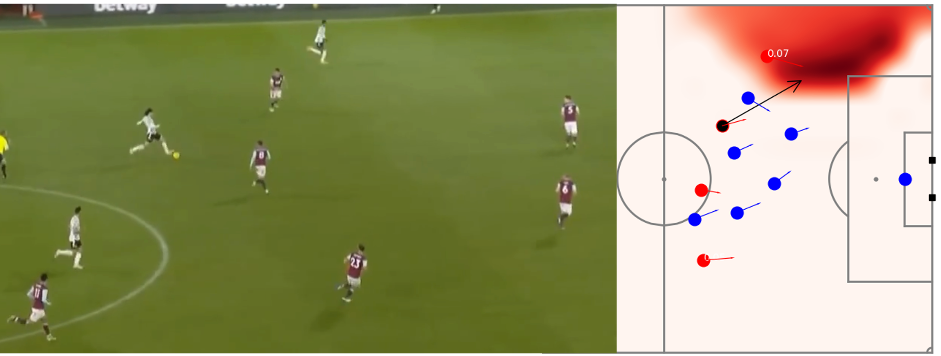
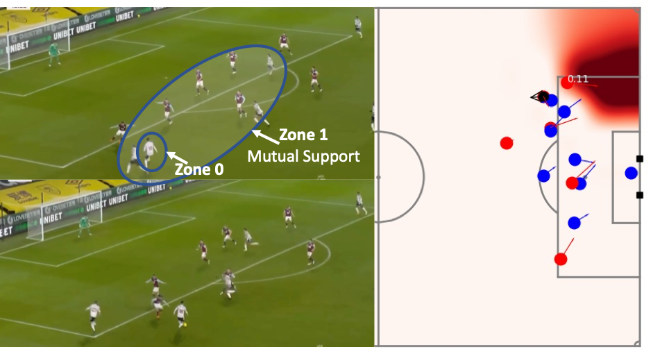

Case study: off-ball runs
=========================

> “What do you do during 87 minutes when you do not have the ball? That is what determines whether 
you’re a good player or not” - Johan Cruyff

Since wingers and forwards can spend as little as 90 seconds on-ball during a game, 
what they do when they have the ball accounts for about 1/40th of a player’s contribution 
during the 60 minutes the ball is typocally in play. The biggest and most exciting 
aspect of football analytics just now is understanding how player movements create space, 
how we can help them improve that movement and (for scouting) measuring how individuals contribute 
to the team when off the ball.

We are now able to start creating models of movement which Cruyff might have appreciated. Let’s 
take an example: Manchester United’s, Marcus Rashford is running down the left wing, and in doing 
so he opens up a space where he can receive the ball. The red shading in the top part of the 
figure shows the value of that space.
 

The value of the space is calculated using a combination of two mathematical models we have met. 
The first of these is [pitch control](../lesson6/PitchControl.md), which tells us the probability that a pass is successful. 
The second is the probability that Manchester United will score if the pass is successful. 
This is (action-based) [expected threat](../lesson4/xTAction.md). 
Multiplying these two measurements allows us to estimate the probability that a pass to 
Rashford will lead to a goal. 

Importantly, we can assign this value to the run, even if Rashford does not 
receive the pass or if (as was actually the case for this particular pass) if the pass is 
weighted poorly and Rashford has to slow down to receive it. 

An example illustrating this point can be seen below. 

Now the player of interest is 
Luke Shaw, who overlaps on the left wing. The two pictures show how he first accelerates and 
opens up a space on the left. Again, our model shows the value of the space down the wing. In 
this case the pass doesn’t come to him, but goes centrally. But the value comes both from the 
fact that the defenders have to move to close him down, opening up new spaces, and the 
fact that he provides an additional passing option.

 
This framework, of calculating the combined probability of the success of a pass and the 
probability it results in a goal has many different names. In an article for the 
Sloan sports conference in 2019, with Fran Peralta, Javier Fernandez  
and Pablo Pinacres-Arce (Hammarby woman’s team coach) we called it PP*PI 
(where PP is the pass success probability and PI stands for pitch impact, 
the probability the pass results in a goal). In another article, 
Fernandez and his colleagues called a similar measure EPV (Expected Possession Value). 
I will call this measure *Off-Ball Expected Threat*, following the naming we have used up until now. 
Off-Ball Expected Threat, is the potential value created by the movement of a player who does not 
receive the ball.

Off-Ball Expected Threat is a starting point for addressing Johan Cruyff’s 87-minute challenge. 
I write starting point, because there is still a lot of work to be done. Attacking runs 
are just one of a wide-range of activities players carry out. Remember, football is a complex sport, 
we have to be modest about what we can achieve. There is no single equation which solves the game. 
Just some of the examples of activities include: pressing in the final third, 
man and zonal marking in the box, creating pressure on passes in the midfield, 
running to create space for the ball holder, defending crosses... 

On the next page we will look at some of these.
