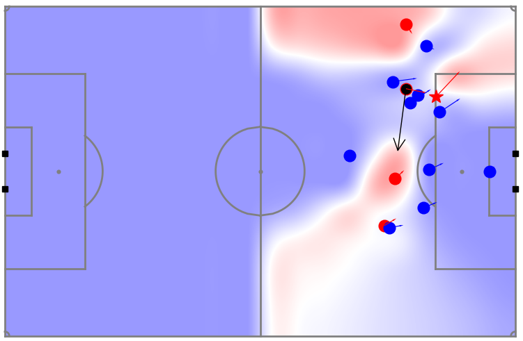
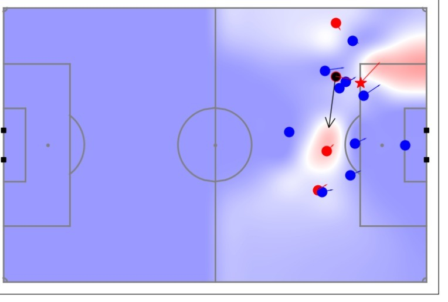

Valuing off-ball actions
========================

Introduction video is here.

<iframe width="640" height="360" src="https://www.youtube.com/embed/SJTa_qdGC5A" title="YouTube video player" frameborder="0" allow="accelerometer; autoplay; clipboard-write; encrypted-media; gyroscope; picture-in-picture" allowfullscreen></iframe>

### Valuing attacking runs

One way of evaluating actions using tracking data is to look at the space created at the point an
action is performed. The data you have access to for your final project, has 
freeze-frame data of every action, such that event data is supplemented with tracking 
data from Skillcorner showing the position and direction of all players near to that action 
(i.e. in the frame of the TV broadcast footage). 

Once the freeze frame data of a pass is created, the key to evaluating a player is looking at the pass alternatives available at that point. To determine this, we first calculate the pitch control 
(probability of receiving a pass) as illustrated below.

We then multiply it point for point with expected threat 
(probability of scoring given a pass succeeds) which we saw in lesson 4.

This essentially gives the probability a team will score if the pass is made. This is shown below

Notice that this again gives a natural way in which to measure actions. It is the probability that a goal
will be scored if the pass succeeds. In this case, the more central pass to Mane was 
roughly the same value as the space Firmino opened up with his run.

### Implementing off-ball xT

In this video Laurie Shaw describes how you can value player actions by combining an expected threat style 
model with a pitch control to investigate the best passing options available to the player on 
the ball at any moment of a game. Laurie refers to Expected Threat as EPV here, but it is created using the same 
principles we adopted in [lesson 4](../lesson4/xTPos.md) for fitting position-based Expected Threat.

<iframe width="640" height="480" src="https://www.youtube.com/embed/KXSLKwADXKI" title="YouTube video player" frameborder="0" allow="accelerometer; autoplay; clipboard-write; encrypted-media; gyroscope; picture-in-picture" allowfullscreen></iframe>

Code for this tutorial can be found [here](https://github.com/Friends-of-Tracking-Data-FoTD/LaurieOnTracking).

An interactive visualisation of the Expected Threat used by Laurie in this video can be found [here](https://chart-studio.plotly.com/~laurieshaw/71/#/)

### References 

Decomposing the Immeasurable Sport: A deep learning expected possession value framework for soccer is [here](http://www.lukebornn.com/papers/fernandez_sloan_2019.pdf)

Beyond Expected Goals can be downloaded [here](https://www.researchgate.net/profile/William-Spearman/publication/327139841_Beyond_Expected_Goals/links/5b7c3023a6fdcc5f8b5932f7/Beyond-Expected-Goals.pdf)

Probabilistic movement models and zones of control is [here](https://link.springer.com/article/10.1007/s10994-018-5725-1)

The right place at the right time: Advanced off-ball metrics for exploiting an opponent&rsquo;s spatial weaknesses in soccer is [here](https://www.sloansportsconference.com/research-papers/the-right-place-at-the-right-time-advanced-off-ball-metrics-for-exploiting-an-opponents-spatial-weakenesses-in-soccer)

